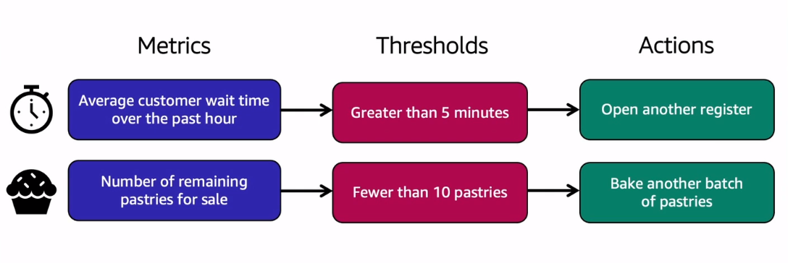
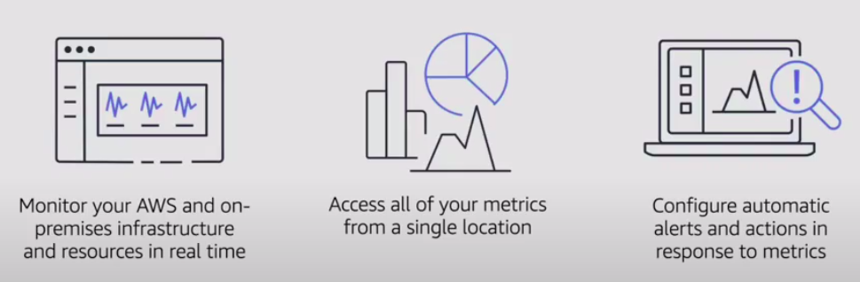
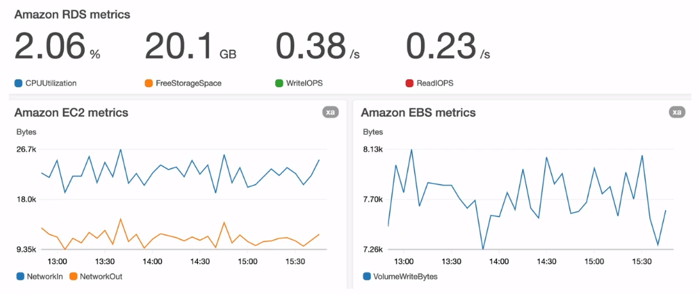

# [Amazon CloudWatch](https://docs.aws.amazon.com/AmazonCloudWatch/latest/monitoring/WhatIsCloudWatch.html)

> 
>
> Example: Coffee Shop Metrics

**Amazon CloudWatch** monitors your Amazon Web Services (AWS) resources and the applications you run on AWS in real time. You can use CloudWatch to collect and track metrics, which are variables you can measure for your resources and applications.

The CloudWatch home page automatically displays metrics about every AWS service you use. You can additionally create custom dashboards to display metrics about your custom applications, and display custom collections of metrics that you choose.

You can create alarms that watch metrics and send notifications or automatically make changes to the resources you are monitoring when a threshold is breached. With CloudWatch, you gain system-wide visibility into resource utilization, application performance, and operational health.

> 

## Amazon CloudWatch Dashboard
> 