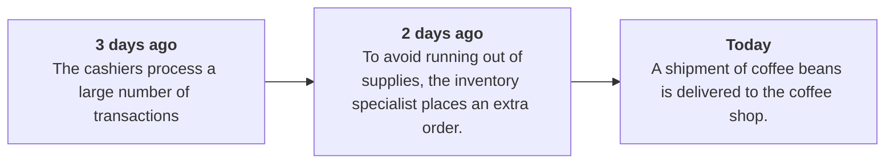

# [AWS CloudTrail](https://docs.aws.amazon.com/awscloudtrail/latest/userguide/cloudtrail-user-guide.html)

Track user activity and API usage in your AWS account
* Log files are delivered to Amazon S3 buckets
* Automatically detect unusual account activity
* Continuously monitor user activities and record API calls
* Useful for compliance auditing, security analysis, and troubleshooting
* Filter logs generated by API calls to assist with operational analysis and troubleshooting

**API Security-Relevant Information**
* Who?
* What?
* When?
* Where?

**Example: Coffee Shop Events**

 

**AWS CloudTrail** is an AWS service that helps you enable operational and risk auditing, governance, and compliance of your AWS account. Actions taken by a user, role, or an AWS service are recorded as events in CloudTrail. Events include actions taken in the AWS Management Console, AWS Command Line Interface, and AWS SDKs and APIs.

CloudTrail is enabled on your AWS account when you create it. When activity occurs in your AWS account, that activity is recorded in a CloudTrail event. You can easily view recent events in the CloudTrail console by going to Event history.

## AWS CloudTrail Event
