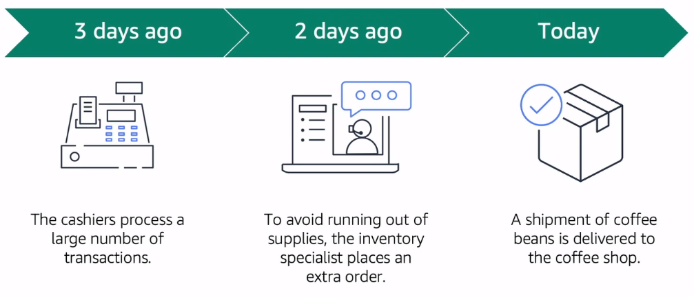
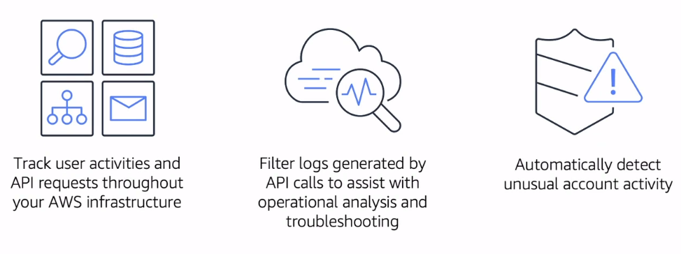
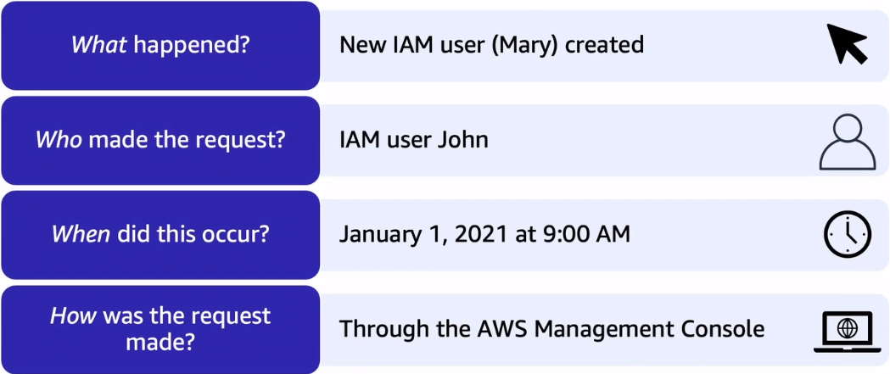

# [AWS CloudTrail](https://docs.aws.amazon.com/awscloudtrail/latest/userguide/cloudtrail-user-guide.html)

> 
>
> Example: Coffee Shop Events

**AWS CloudTrail** is an AWS service that helps you enable operational and risk auditing, governance, and compliance of your AWS account. Actions taken by a user, role, or an AWS service are recorded as events in CloudTrail. Events include actions taken in the AWS Management Console, AWS Command Line Interface, and AWS SDKs and APIs.

CloudTrail is enabled on your AWS account when you create it. When activity occurs in your AWS account, that activity is recorded in a CloudTrail event. You can easily view recent events in the CloudTrail console by going to Event history.

> 

## AWS CloudTrail Event
> 