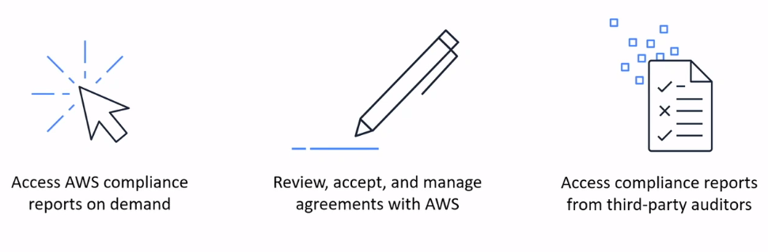

# Compliances

### [AWS Artifact](https://aws.amazon.com/artifact/)
**AWS Artifact** provides on-demand access to security and compliance reports and select online agreements. AWS Artifact provides on-demand downloads of AWS security and compliance documents, such as AWS ISO certifications, Payment Card Industry (PCI) reports, and Service Organization Control (SOC) reports. You can submit the security and compliance documents (also known as audit artifacts) to your auditors or regulators to demonstrate the security and compliance of the AWS infrastructure and services that you use. You can also use these documents as guidelines to evaluate your own cloud architecture and assess the effectiveness of your company's internal controls.

## Reference
* [AWS Artifact FAQs](https://aws.amazon.com/artifact/faq/)
* [What is AWS Artifact?](https://docs.aws.amazon.com/artifact/latest/ug/what-is-aws-artifact.html)