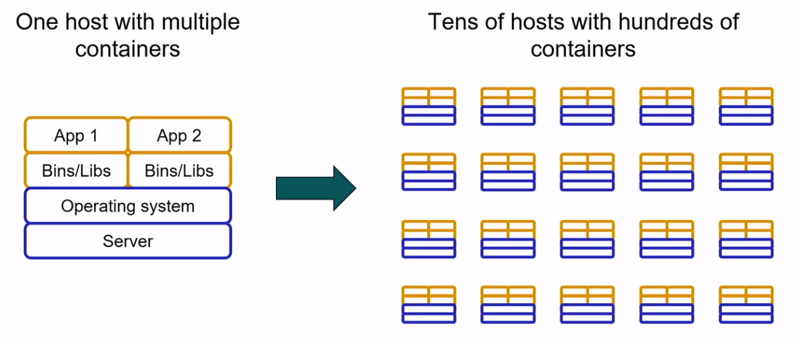

# AWS Container Services

### What are containers?

Containers provide a standard way to package your application's code, configurations, and dependencies into a single object. Containers share an operating system installed on the server and run as resource-isolated processes, ensuring quick, reliable, and consistent deployments, regardless of environment.

### Why use containers?
Containers are a powerful way for developers to package and deploy their applications. They are lightweight and provide a consistent, portable software environment for applications to easily run and scale anywhere. Building and deploying microservices, running batch jobs, for machine learning applications, and moving existing applications into the cloud are just some of the popular use cases for containers.

* **Secure**
* **Reliable**
* **Choice**
* **AWS Integrations**

## AWS Container Orchestration Services
### Amazon Elastic Container Service (Amazon ECS)
* Run and scale containerized applications
* Use simple API calls to control Docker-enabled applications

### Amazon Elastic Kubernetes Service (Amazon EKS)
* Run and scale Kubernetes applications
* Readily update applications with new features

## AWS Fargate
* Run serverless containers with Amazon ECS or Amazon EKS
* Pay only for the resources you use

## Reference
* [Containers](https://aws.amazon.com/getting-started/deep-dive-containers/)