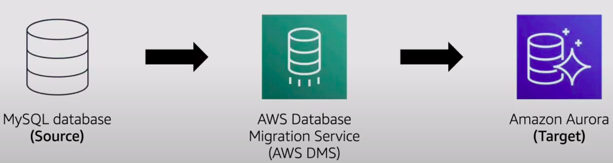

# AWS Databases

### Nonrelational Databases
* A **nonrelational databases** uses structures other than rows and colums to organize data
* For example, with **key-value pairs**, data is organized into items (keys), and items have attributes (values)

Example:
<table>
  <tr>
    <th>Key</th>
    <th>Value</th>
  </tr>
  <tr>
    <td>1</td>
    <td>
     Name: John Doe  
     Address: 123 Any Street  
     Favorite Drink: Medium latte
    </td>
  </tr>
  <tr>
    <td>2</td>
    <td>
     Name: Mary Major  
     Address: 100 Main Street  
     Birthday: July 5, 1994
    </td>
  </tr>
</table>

## [Amazon Relational Database Service (RDS)](https://aws.amazon.com/rds/)
* Operate and scale a relational database in AWS Cloud
* Automate time-consuming administrative tasks
* Store and transmit data securely

### AWS RDS Database Engines
* Amazon Aurora
* PostgreSQL
* MySQL
* MariaDB
* Oracle Database
* Microsoft SQL Server

## [Amazon Aurora](https://aws.amazon.com/rds/aurora/)
* Store data in an enterprise-class relational database
* Reduce database costs by eliminating unnecessary input/output (I/O) operations
* Replicate six copies of data across three Availability Zones

## [Amazon DynamoDB](https://aws.amazon.com/dynamodb/)
* Amazon DynamoDB is a serverless key-value database
* It automatically scales to adjust for capacity change and maintain consistent performance
* It is designed to handle over 10 trillion requests per day

## [AWS Database Migration Service](https://aws.amazon.com/dms/)
Migrate relational databases, nonrelational databases, and other types of data stores.

## Additional Database Services
### [Amazon Redshift](https://aws.amazon.com/redshift/)
Query and analyze data across a data warehouse

### [Amazon DocumentDB](https://aws.amazon.com/documentdb/)
Run MongoDB workloads in a document database service

### [Amazon Neptune](https://aws.amazon.com/neptune/)
Run applications that use highly connected datasets

### [Amazon Quantum Ledger Database (QLDB)](https://aws.amazon.com/qldb/)
Review a complete history of changes to your application