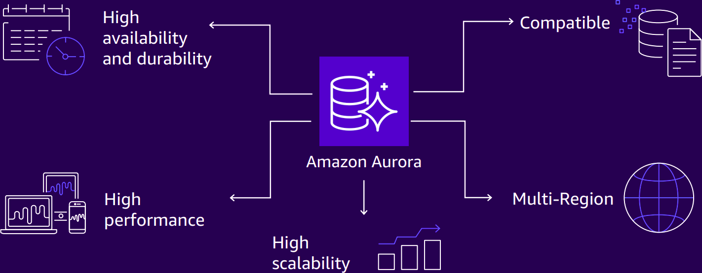
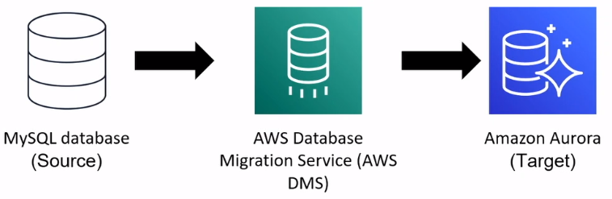

# AWS Databases

### DIY (Unmanaged services) Compared to AWS Database Services (Managed services)

#### Databases on Amazon EC2
* Operating system access
* Need features of specific application

#### AWS Database Services
* Simple to set up, manage, maintain
* Push-button high availability
* Focus on performance
* Managed infrastructure

### Purpose-built databases

### AWS Database Options

### Relational databases
* In a relational database, data is stored in a way that relates it to other pieces of data
* Relational dabases use structured query language (SQL) to store and query data

### [Amazon Relational Database Service (RDS)](https://aws.amazon.com/rds/)

Set up, operate, and scale a relational database in the cloud with just a few clicks.

* Operate and scale a relational database in the AWS Cloud
* Automate time-consuming administrative tasks
* Store and transmit data securely

**Amazon RDS Database Engines**
* Amazon Aurora
* PostgreSQL
* MySQL
* MariaDB
* Oracle Database
* Microsoft SQL Server

### [Amazon Aurora](https://aws.amazon.com/rds/aurora/)
Relational database built for the cloud; compatible with MySQL and PostgreSQL.

* Store data in an enterprise-class relational database
* Reduce database costs by eliminating unnecessary input/output (I/O) operations
* Replicate six copies of data across three Availability Zones

### Non-relational Databases
* A **non-relational databases** uses structures other than rows and colums to organize data
* For example, with **key-value pairs**, data is organized into items (keys), and items have attributes (values)

    Example:
    <table>
      <tr>
        <th>Key</th>
        <th>Value</th>
      </tr>
      <tr>
        <td>1</td>
        <td>
        Name: John Doe  
        Address: 123 Any Street  
        Favorite Drink: Medium latte
        </td>
      </tr>
      <tr>
        <td>2</td>
        <td>
        Name: Mary Major  
        Address: 100 Main Street  
        Birthday: July 5, 1994
        </td>
      </tr>
    </table>

### [Amazon DynamoDB](https://aws.amazon.com/dynamodb/)
Fast and flexible NoSQL database service for any scale.

* Amazon DynamoDB is a *serverless* key-value database
* It automatically scales to adjust for capacity changes and maintain consistent performance
* It is designed to handle over 10 trillion requests per day

### [AWS Database Migration Service](https://aws.amazon.com/dms/)
Migrate relational databases, nonrelational databases, and other types of data stores.

### Amazon RDS and Amazon DynamoDB
For each scenario, should you use Amazon RDS or Amazon DynamoDB?

## Additional Database Services
* [**Amazon Redshift**](https://aws.amazon.com/redshift/)
  * Query and analyze data across a data warehouse

* [**Amazon DocumentDB**](https://aws.amazon.com/documentdb/)
  * Run MongoDB workloads in a document database service

* [**Amazon Neptune**](https://aws.amazon.com/neptune/)
  * Run applications that use highly connected datasets

* [**Amazon Quantum Ledger Database (QLDB)**](https://aws.amazon.com/qldb/)
  * Review a complete history of changes to your application

* [**Amazon Managed Blockchain**](https://docs.aws.amazon.com/whitepapers/latest/aws-overview/blockchain.html)
  * Run a decentralized ledger database

* [**Amazon ElastiCache**](https://aws.amazon.com/elasticache/)
  * Add caching layers to improve database read times

* [**Amazon DynamoDB Accelerator**](https://aws.amazon.com/dynamodb/dax/)
  * Improve DynamoDB response times from single-digit milliseconds to microseconds