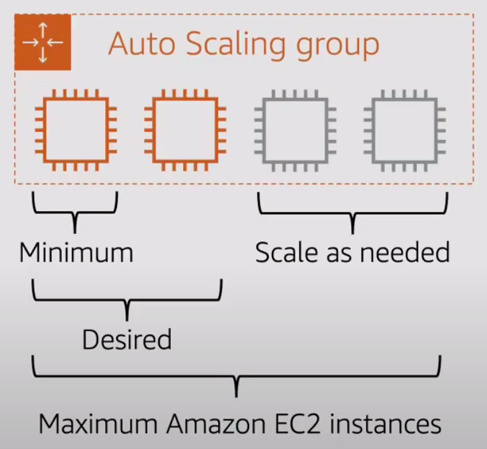

# Amazon EC2 Auto Scaling

Amazon EC2 Auto Scaling helps you ensure that you have the correct number of Amazon EC2 instances available to handle the load for your application. You create collections of EC2 instances, called ***Auto Scaling groups***. You can specify the **minimum number of instances** in each Auto Scaling group, and Amazon EC2 Auto Scaling ensures that your group never goes below this size. You can specify the **maximum number of instances** in each Auto Scaling group, and Amazon EC2 Auto Scaling ensures that your group never goes above this size. If you specify the **desired capacity**, either when you create the group or at any time thereafter, Amazon EC2 Auto Scaling ensures that your group has this many instances. If you specify **scaling policies**, then Amazon EC2 Auto Scaling can launch or terminate instances as demand on your application increases or decreases.

## Benefits
Adding Amazon EC2 Auto Scaling to your application architecture is one way to maximize the benefits of the AWS Cloud. When you use Amazon EC2 Auto Scaling, your applications gain the following benefits:

* Better fault tolerance. Amazon EC2 Auto Scaling can detect when an instance is unhealthy, terminate it, and launch an instance to replace it. You can also configure Amazon EC2 Auto Scaling to use multiple Availability Zones. If one Availability Zone becomes unavailable, Amazon EC2 Auto Scaling can launch instances in another one to compensate.
* Better availability. Amazon EC2 Auto Scaling helps ensure that your application always has the right amount of capacity to handle the current traffic demand.
* Better cost management. Amazon EC2 Auto Scaling can dynamically increase and decrease capacity as needed. Because you pay for the EC2 instances you use, you save money by launching instances when they are needed and terminating them when they aren't.

## Reference
* [What is Amazon EC2 Auto Scaling?](https://docs.aws.amazon.com/autoscaling/ec2/userguide/what-is-amazon-ec2-auto-scaling.html)