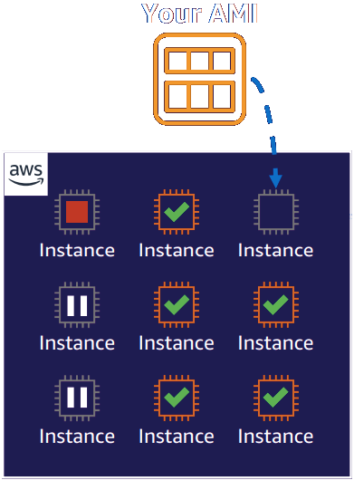

# Amazon Elastic Compute Cloud (Amazon EC2)

Amazon EC2 provides pay-as-you-go pricing and a broad selection of hardware and software that's available via the AWS Marketplace by using Amazon Machine Images (AMIs)

* Pay only for what you use
* Resizable compute capacity
* Complete control of your computing resources
* Reduced time required to obtain and boot new server instances

Template for:
<ul>
  <li>Storage volumes</li>
  <li>Launch permissions</li>
  <li>A block device mapping</li>
</ul>

 

<b>Examples</b>
<ul>
  <li>Application server</li>
  <li>Web server</li>
  <li>Database server</li>
  <li>Game server</li>
  <li>Mail server</li>
  <li>Media server</li>
  <li>Catalog server</li>
  <li>File server</li>
</ul>

### Virtual Machines vs. Physical Servers
Amazon EC2 can solve some problems that are more difficult with an on-premises server.

When using disposable resources:

### Benefits of Amazon EC2
* Elasticity
* Control
* Flexibility
* Integrated
* Reliable
* Secure
* Inexpensive
* Simple

### Amazon EC2 Instance Families and Names
Choosing the correct type is very important for **efficient use of your instances and cost reduction**.

#### General Purpose
* Suitable for a broad range of workloads
* Balances compute, memory, and networking resources
* **Use cases**
  * Small databases and midsize databases
  * Low-traffic websites and web applications

#### Compute Optimized
* Offers high-performance processors
* Ideal for compute-intensive applications and batch processing workloads
* **Use cases**
  * Video encoding
  * High-performance web servers

#### Memory Optimized
* Delivers fast performance for memory-intensve workloads
* Well suited for high-performance databases
* **Use cases**
  * Distributed memory caches
  * High-performance databases

#### Storage Optimized
* Offers low latency and high input/output operations per seconds (IOPS)
* Suitable for workloads such as distributed file systems and data warehousing applications
* **Use cases**
  * Data warehousing
  * Log or data processing applications

#### Accelerated Computing
* Uses hardware accelerators to expedite data processing
* Ideal for application streaming and graphics workloads
* **Use cases**
  * 3D visualizations
  * Machine learning

### Instance Pricing Options

#### On-Demand
* No upfront costs or minimum contracts
* Ideal for short-term, irregular workloads

#### Spot
* Ideal for workloads with flexible start and end times
* Offers savings over On-Demand prices
* Can withstand interruptions

#### Reserved
* Provides a billing discount over On-Demand pricing
* Requires a 1-year or 3-year term commitment

#### Compute Savings Plan
* Offers up to 72% savings over On-Demand costs for a consistent amount of compute usage
* Requires a 1-year or 3-year term commitment

#### Dedicated Instance
* An EC2 *instance* that runs in a VPC on hardware for a single customer
* Higher cost compared to standard Amazon EC2 instances

#### Dedicated Host
* A *physical server* with EC2 instance capacity for a single customer
* Most expensive Amazon EC2 option

### How Amazon EC2 Works
