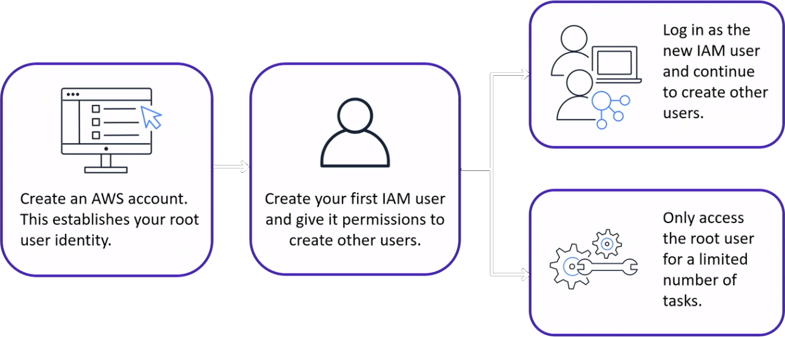

# AWS Identity and Access Management (IAM)
**AWS Identity and Access Management (IAM)** is a web service that helps you securely control access to AWS resources. With IAM, you can centrally manage permissions that control which AWS resources users can access. You use IAM to control who is authenticated (signed in) and authorized (has permissions) to use resources. AWS Identity and Access Management (IAM) allows you to manage acces to AWS services and resources.

Securely control access to your AWS resources
* Assign granular permissions to users, groups, or roles
* Share temporary access to your AWS account
* Federate users in your corporate network or with an internet identity provider


## AWS Account Root User


## IAM User
An **IAM User** is an identity that represents a person or application that interacts with AWS services and resources.

**Best practice**: Create individual IAM users for each person who needs to accses AWS.

## IAM Policies
An **IAM Policy** is a document that grants or denies permissions to AWS services and resources.

**Best practice**: Follow the security principle of least privilege.

Example:
```json
{
  "Version": "2012-10-17",
  "Statement": {
    "Effect": "Allow",
    "Action": "s3:ListObject",
    "Resource": "arn:aws:s3:::awsdoc-example-bucket"
  }
}
```

This sample IAM policy allows permission to accses the objects in the Amazon S3 bucket with ID: *awsdoc-example-bucket*.

## IAM Groups
An **IAM Group** is a collection of IAM users.

**Best practice**: Attach IAM policies to IAM groups, rather than to individual IAM users.

Members inherit the policies assigned to the group.


## IAM Roles
An IAM Role is an identity that you can assume to gain temporary access to permissions.


## Multi-factor Authentication
**Multi-factor authentication** provides an extra layer of protection for your AWS account.

