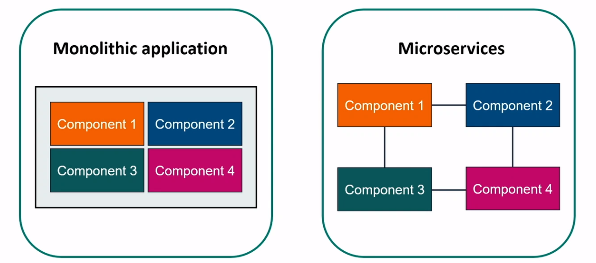
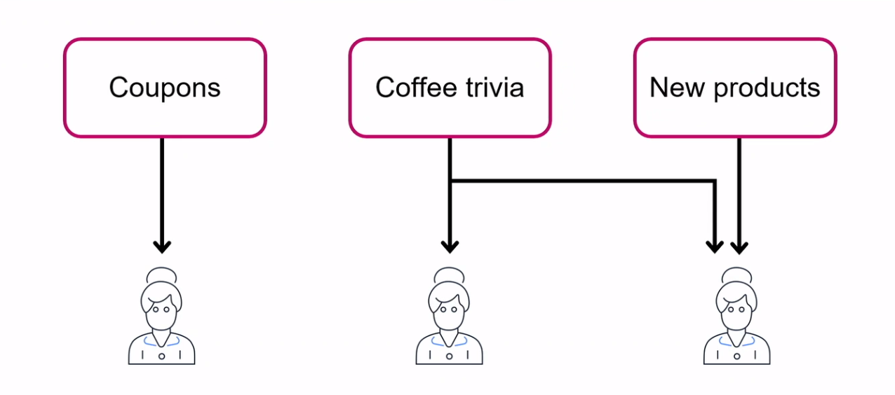
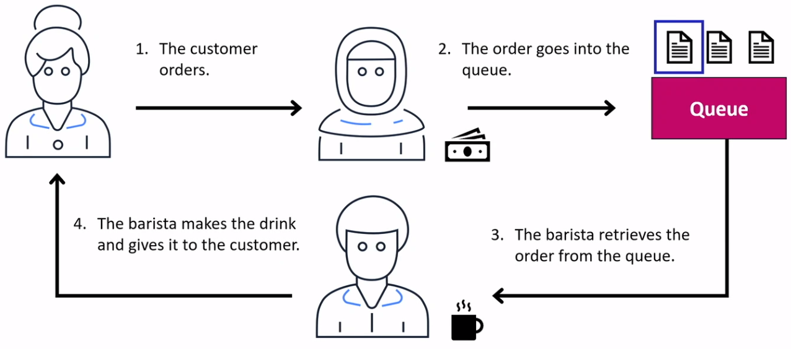

# AWS Messaging Services
AWS messaging services enable different software systems and end devices–often using different programming languages, and on different platforms–to communicate and exchange information. You can use AWS messaging services to send and receive data in your cloud applications. The underlying infrastructure is automatically provisioned for high availability and message durability to support the reliability of your applications

## Application Architecture

### Amazon Simple Notification Service (Amazon SNS)
* Messages are published to topics
* Subscribers immediately receive messages for their topics
* A syncrhonous, managed service that provides the end user with the abilit to deliver or send messages to one or more endpoints or clients

### Amazon Simple Queue Service (Amazon SQS)
* Send, store, and receive messages between software components
* Queue messages without requiring other services to be available

