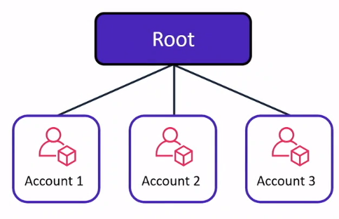

# AWS Organizations

**AWS Organizations** is an account management service that enables you to consolidate multiple AWS accounts into an organization that you create and centrally manage. AWS Organizations includes account management and consolidated billing capabilities that enable you to better meet the budgetary, security, and compliance needs of your business. As an administrator of an organization, you can create accounts in your organization and invite existing accounts to join the organization. AWS Organizations helps customers consolidate and manage multiple AWS accounts in a central location. To centrally control permissions for the accounts in your organization, use **service control policies (SCPs)**.

> 

### Example: Organizational Units
> 

## Terminology and Concepts

> 

### Organization
An entity that you create to consolidate your AWS accounts so that you can administer them as a single unit. You can use the AWS Organizations console to centrally view and manage all of your accounts within your organization. An organization has one management account along with zero or more member accounts. You can organize the accounts in a hierarchical, tree-like structure with a root at the top and organizational units nested under the root. Each account can be directly in the root, or placed in one of the OUs in the hierarchy. An organization has the functionality that is determined by the feature set that you enable.

### Root
The parent container for all the accounts for your organization. If you apply a policy to the root, it applies to all organizational units (OUs) and accounts in the organization.

### Organizational unit (OU)
A container for accounts within a root. An OU also can contain other OUs, enabling you to create a hierarchy that resembles an upside-down tree, with a root at the top and branches of OUs that reach down, ending in accounts that are the leaves of the tree. When you attach a policy to one of the nodes in the hierarchy, it flows down and affects all the branches (OUs) and leaves (accounts) beneath it. An OU can have exactly one parent, and currently each account can be a member of exactly one OU.

### Account
An account in Organizations is a standard AWS account that contains your AWS resources and the identities that can access those resources.

### Service control policy (SCP)
A policy that specifies the services and actions that users and roles can use in the accounts that the SCP affects. SCPs are similar to IAM permissions policies except that they don't grant any permissions. Instead, SCPs specify the maximum permissions for an organization, organizational unit (OU), or account. When you attach an SCP to your organization root or an OU, the SCP limits permissions for entities in member accounts.

## Reference
* [What is AWS Organizations?](https://docs.aws.amazon.com/organizations/latest/userguide/orgs_introduction.html)
* [AWS Organizations terminology and concepts](https://docs.aws.amazon.com/organizations/latest/userguide/orgs_getting-started_concepts.html)