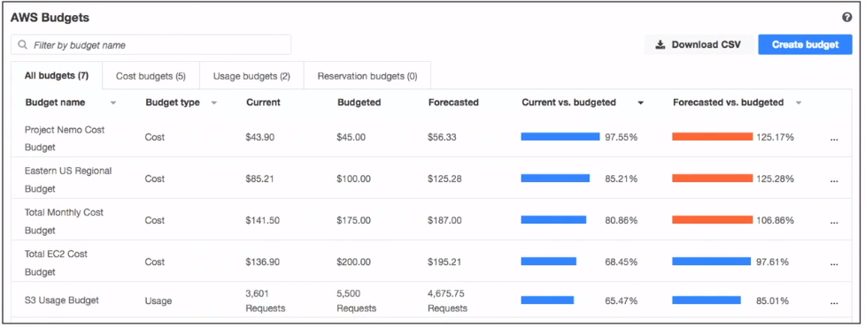
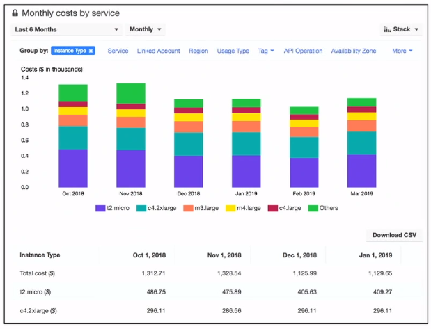

# AWS Pricing Tools

### AWS Budgets
AWS Budget is a tool that you can use to set thresholds for your AWS service usage and costs.

> 

### AWS Cost Explorer
AWS Cost Explorer is a tool that you can use to visualize, understand, and manage your AWS costs and usage over time.

> 