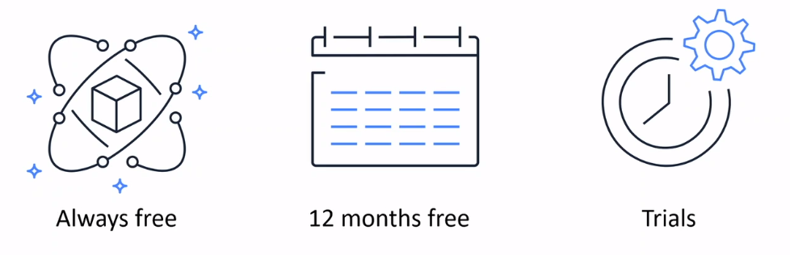
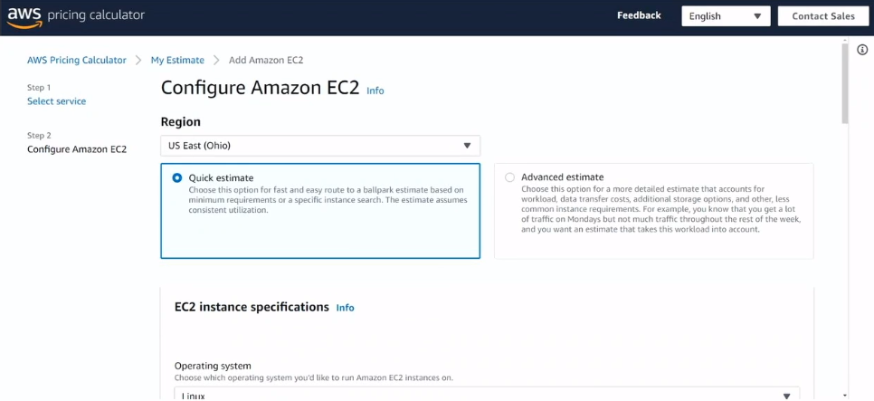
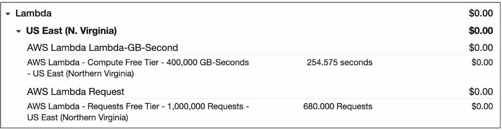
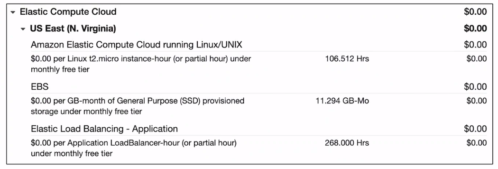
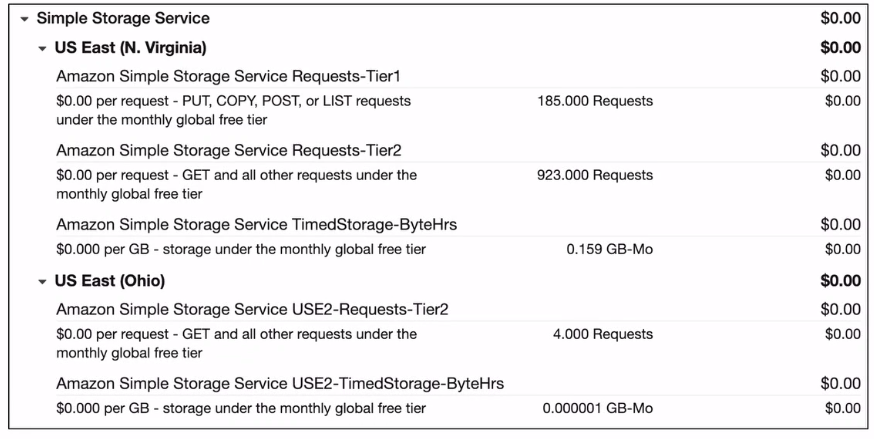

# AWS Pricing

### AWS Free Tier Categories
> 

## AWS Pricing Concepts
### Pay as you go
Pay only for the resources that you use without provisioning capacity in advance.

### Pay less when you reserve
Reduce costs by resrving capacity in services such as Amazon Elastic Compute Cloud (Amazon EC2) and Amazon Relational Database Service (Amazon RDS).

### Pay less with volume-based discounts
Receive savings through volume-based discounts as your usage increases.

## AWS Pricing Calculator
> 

## AWS Lambda Pricing
* Pay only for the compute time you use
* Pay for the number of requests for your functions
* Save by signing up for a Compute Savings Plan

> 
>
> Example: AWS Lambda Service Charges

## Amazon EC2 Pricing
* Pay only for the time that your On-Demand Instances run
* Reduce costs by using Spot Instances for recommended use cases
* Save by signing up for a Compute Savings Plan
* Amazon EC2 Pricing: https://aws.amazon.com/ec2/pricing/

> 
>
> Example: AWS EC2 Service Charges

## Amazon S3 Pricing
Amazon S3 Pricing is based on four factors:
* Storage
* Requests and data retrievals
* Data transfer
* Management and replication

> 
>
> Example: AWS S3 Service Charges