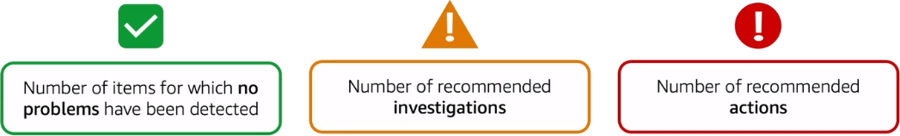
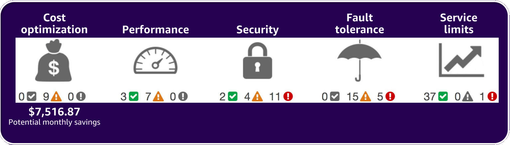
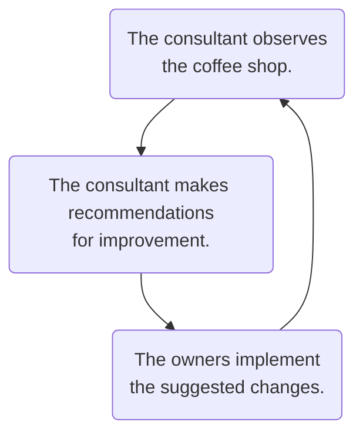

# [AWS Trusted Advisor](https://docs.aws.amazon.com/awssupport/latest/user/trusted-advisor.html)

A service providing guidance to help you reduce cost, increase performance, and improve security.

* Receive real-time guidance for improving your AWS environment
* Compare your infrastructure to AWS best practices in five categories
* Evaluate and implement guidance at all stages of deployment

 

 

**Example: Coffee Shop Improvements**

 

Trusted Advisor draws upon best practices learned from serving hundreds of thousands of AWS customers. Trusted Advisor inspects your AWS environment, and then makes recommendations when opportunities exist to save money, improve system availability and performance, or help close security gaps.