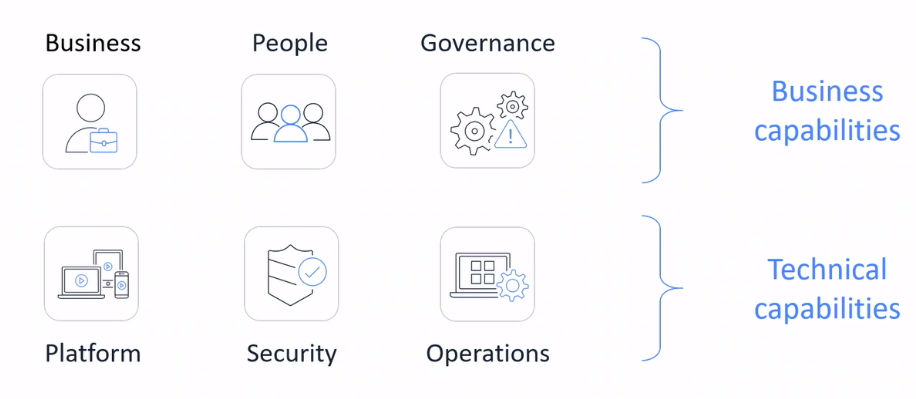

# AWS Cloud Adoption Framework
* Provides advice to your company to enable a quick and smooth migration to AWS
* Organizes guidance into six areas of focus, called *perspectives*

## Perspectives
> 

### Business Perspective
**Goal**

Ensure that IT aligns with business needs and IT investments link to key business results

**Common Roles**
* Business managers
* Finance managers
* Budget owners
* Strategy stakeholders

### People Perspective
**Goal**

Supports development of an organization-wide change management strategy for successful cloud adoption

**Common Roles**
* Human resources
* Staffing
* People managers

### Governance Perspective
**Goal**

Focuses on the skills and processes to algin IT strategy with business strategy

**Common Roles**
* Chief Information Officer (CIO)
* Program managers
* Enterprise architects
* Business analysts
* Portfolio managers

### Platform Perspective
**Goal**

Includes principles and patterns for implementing new solutions in the cloud, and migrating on-premises workloads to the cloud

**Common Roles**
* Chief Technology Officer (CTO)
* IT Managers
* Solution architects

### Security Perspective
**Goal**

Ensures that the organization meets security objectives for visibility, auditability, control, and agility

**Common Roles**
* Chief Information Security Officer (CISO)
* IT Security managers
* IT Security analysts

### Operations Perspective
**Goal**

Helps you to enable, run, use, operate, and recover IT workloads to the level agreed on with your business stakeholders

**Common Roles**
* IT operation managers
* IT support managers