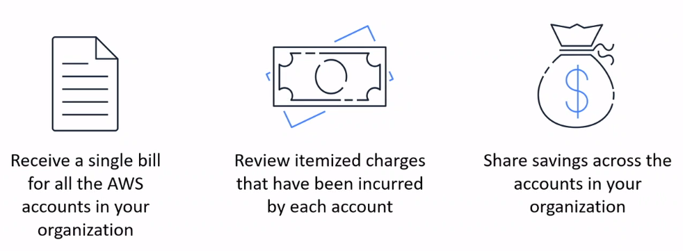
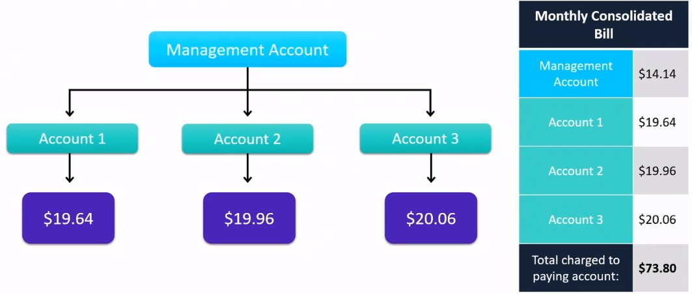

# Consolidated Billing

> 

You can use the consolidated billing feature in AWS Organization to consolidated billing and payment for multiple AWS accounts or multiple Amazon Web Services India Private Limited (AWS India) accounts. Every organization in AWS Organizations has a management account that pays the charges of all the *member accounts*.

Consolidated billing has the following benefits:
* **One bill**
  * You get one bill for multiple accounts.

* **Easy tracking**
  * You can track the charges across multiple accounts and download the combined cost and usage data.

* **Combined usage**
  * You can combine the usage across all accouns in the organization to share the volume pricing discounts, Reserved Instance discounts, and Saving Plans. This can result in a lower charge for your project, departmnet, or company than with individual standalone accounts.

* **No extra fee**
  * Consolidated billing is offered at no additional cost.

### Example
> 

## Reference
* [Consolidated billing for AWS Organizations](https://docs.aws.amazon.com/awsaccountbilling/latest/aboutv2/consolidated-billing.html)