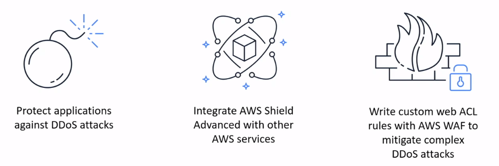
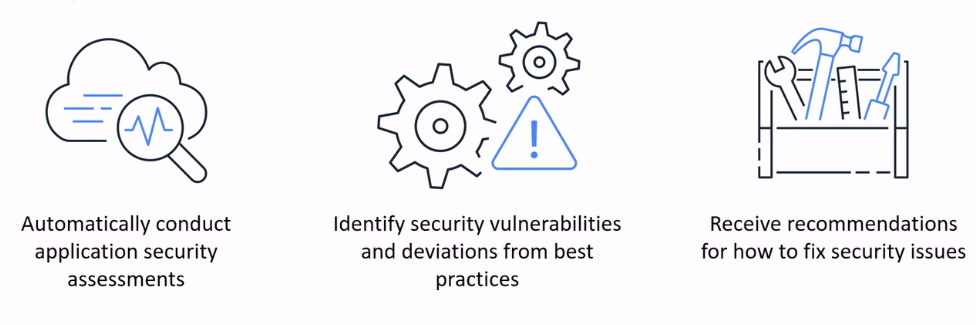

# DoS and DDoS Attacks

AWS automatically mitigates network and transport layer (layer 3 and layer 4) Distributed Denial of Service (DDoS) attacks. If you use Shield Advanced to protect your Amazon EC2 instances, during an attack Shield Advanced automatically deploys your Amazon VPC network ACLs to the border of the AWS network. This allows Shield Advanced to provide protection against larger DDoS events.

> 

## AWS Shield
**AWS Shield** provides protection against distributed denial of service (DDoS) attacks.

## Amazon Inspector
**Amazon Inspector** allows you to perform automated security assessments on your applications.

## AWS Key Management Service
* **AWS Key Management Service (AWS KMS)** helps customers perform encryption operations through the use of cryptographic keys
* You can choose the specific levels of access controls that you need for your keys

## Amazon GuardDuty
Amazon GuardDuty provides intelligent threat detection for AWS products and services.

> 

## Reference
* [Mitigation techniques](https://docs.aws.amazon.com/whitepapers/latest/aws-best-practices-ddos-resiliency/mitigation-techniques.html)
* [Responding to DDoS events](https://docs.aws.amazon.com/waf/latest/developerguide/ddos-responding.html)