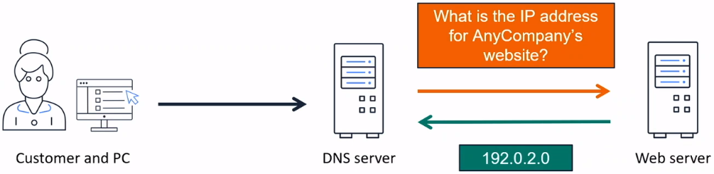

# Interact with the AWS Global Network

### Domain Name System (DNS)
**DNS** or **Domain Name System**, translates human readable domain names (for example, www.amazon.com) to machine readable IP addresses (for example, 192.0.2.4.4).

 

All computers on the Internet, from your smart phone or laptop to the serves that serve content for massive retail websites, find and communicated with one another by using numbers. These numbers are known as IP addresses.When you open a web browser and go to a website, you don't have to remember and enter a long number. Instead you can enter a **domain name** like *example.com* and still end up in the right place. DNS servers translate requests for names into IP addresses, controlling which server an end user will reach when they type a domain name into their web browser. These requests are called **queries**.

### Amazon Route 53

**Amazon Route 53** provides highly available and scalable Domain Name System (DNS), domain name registration, and health-checking webservices. It is designed to give developers and businesses an extremely reliable and cost effective way to route end users to Internet applications by translating names like *example.com* into the numeric IP addresses, such as 192.0.2.1, that computers use to connect to each other.

* Multiple routing options
* DNS translates domain names into IP address
* Connect user requests to infrastructure in AWS and outside of AWS
* Able to purchase and manage domain names and automatically configure DNS settings
* Provides tools for flexible, high-performance, high available architecutres on AWS

## Reference
* [What is DNS?](https://aws.amazon.com/route53/what-is-dns/)
* [Amazon Route 53 FAQs](https://aws.amazon.com/route53/faqs/)