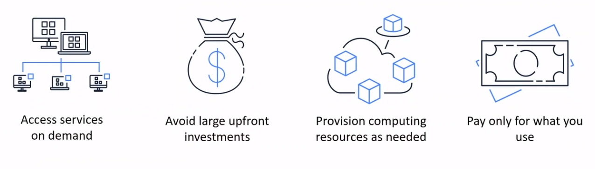
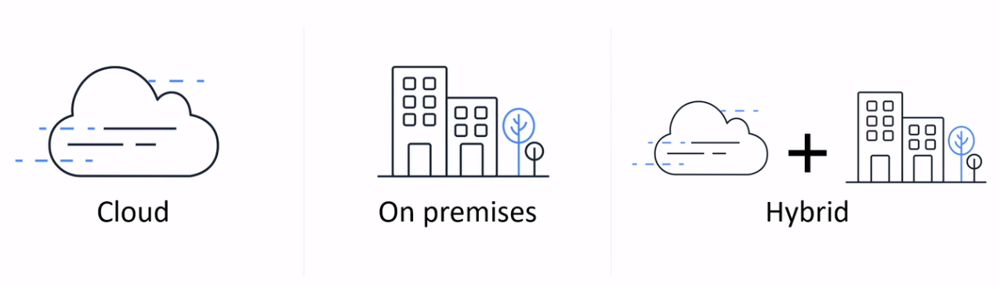
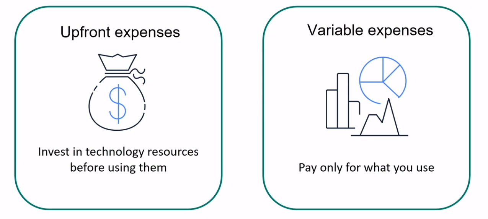
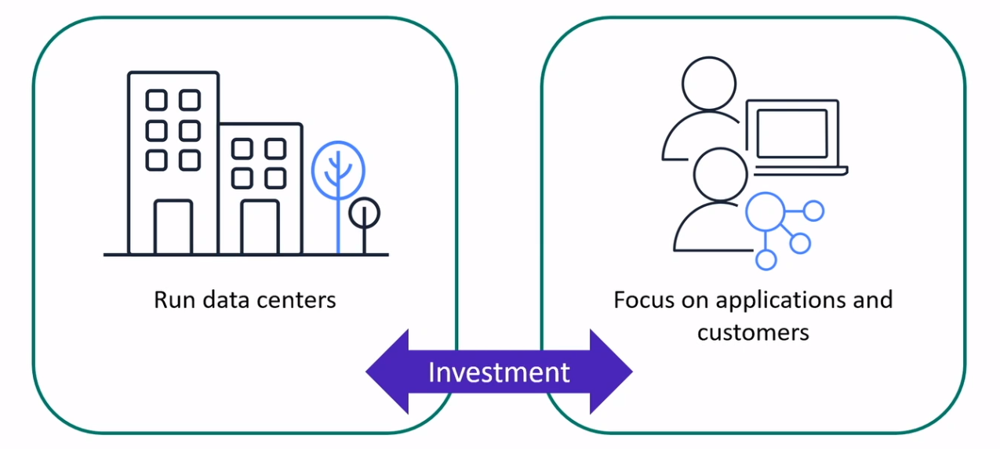
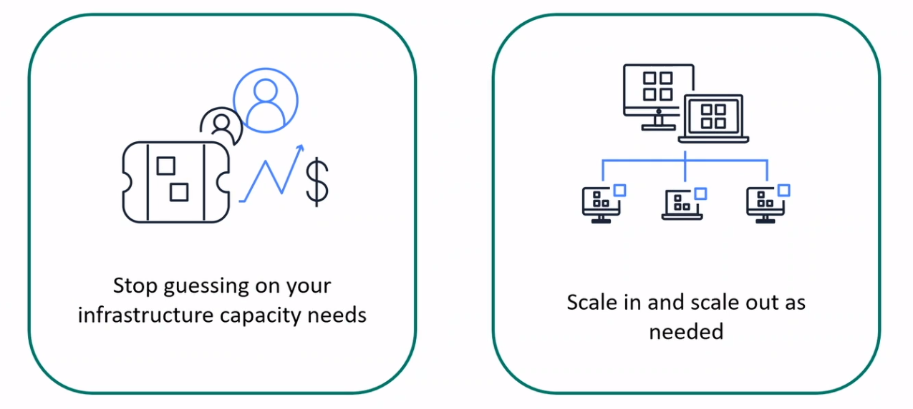
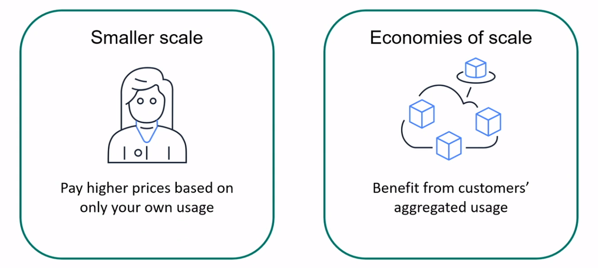
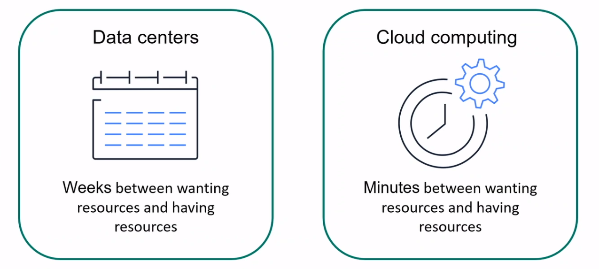
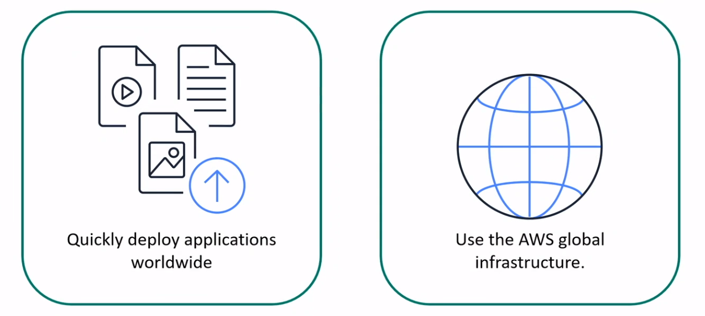

# Introduction to AWS

## What is Cloud Computing?

## Cloud Computing Deployment Models

### Cloud-based deployment
* Run all parts of the application in the cloud
* Migrate existing applications to the cloud
* Design and build new applications in the cloud

### On-premises deployment
* Use virtualization and resource management tools to deploy resources
* Use application management and virtualization technologies to increase resource usage

### Hybrid deployment
* Connect cloud-based resources to on-premises infrastructure
* Integrate cloud-based resources with legacy IT applications

## Cloud Computing Benefits

### Variable Expenses

### Cost Optimization

### Capacity

### Economies of scale

### Speed and agility

### Global in minutes
