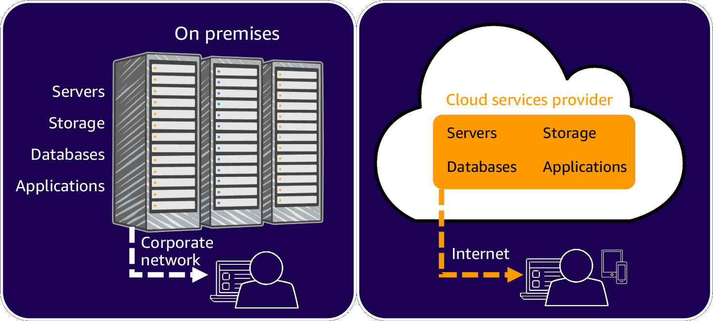
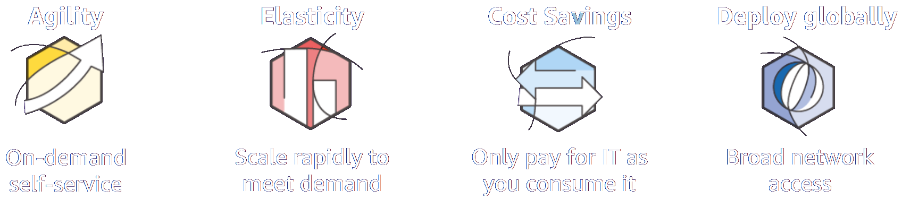
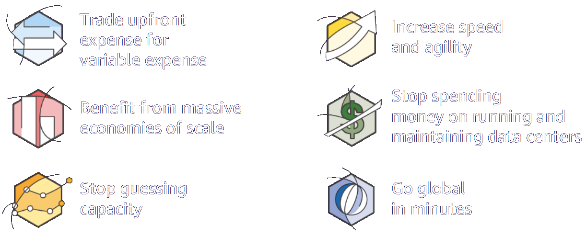
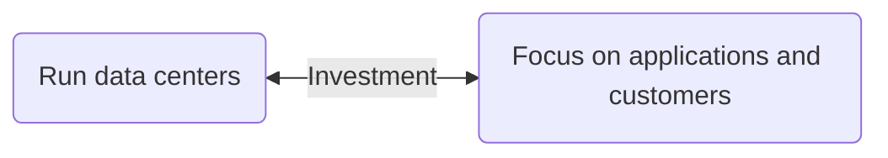
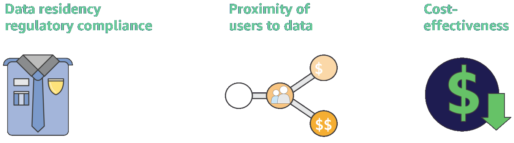
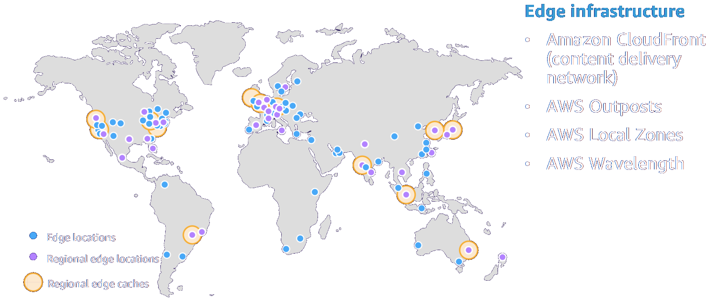
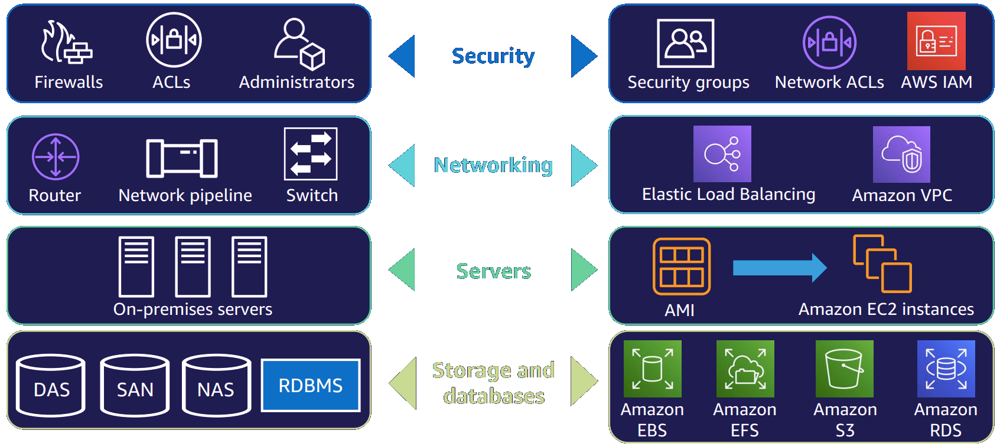
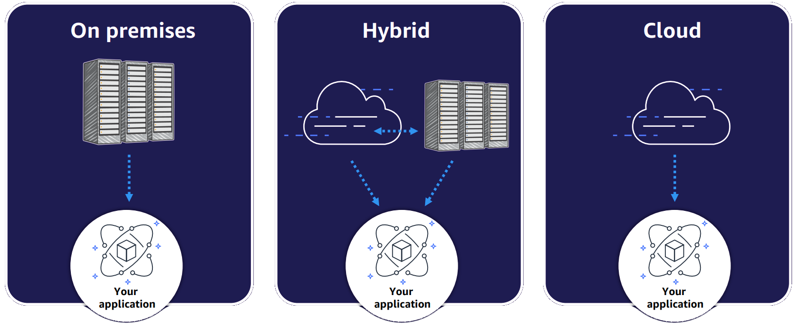

# Introduction to AWS

### What is the cloud?

 

With cloud computing, you can stop thinking of your infrastructure as hardware, and instead think of it (and use it) as software.

### Six Advantages of Cloud Computing

#### Trade upfront expense for variable expense
* **Upfront expenses**
  * Invest in technology resources before using them
* **Variable expenses**
  * Pay only for what you use

#### Benefit from massive economies of scale
* **Smaller scale**
  * Pay higher prices based on only your own usage
* **Economies of scale**
  * Benefit from customers' aggregated usage

#### Stop guessing capacity
* Stop guessing on your infrastructure capacity needs
* Scale in and scale out as needed

#### Increase speed and agility
* **Data centers**
  * Weeks between wanting resources and having resources
* **Cloud computing**
  * Minutes between wanting resources and having resources

#### Stop spending money on running and maintaining data centers

#### Go global in minutes
* Quickly deploy applications worldwide
* Use the AWS global infrastructure

### Choosing a region

#### Data residency regulatory compliance
* Are there relevant Region data privacy laws?
* Can customer data be stored outside the country?

#### Proximity of users to data
* Small differences in latency can impact customer experience
* Choose the Region closest to your users

#### Cost-effectiveness
* Costs vary by Region
* Evaluate cost-effectiveness of replicating data to another Region

### AWS Global Infrastructure

### AWS Edge Infrastructure
<table>
  <tr>
    <th></th>
    <th>AWS Outposts</th>
    <th>AWS Local Zones</th>
    <th>AWS Wavelength</th>
  </tr>
  <tr>
    <td><b>Overview</b></td>
    <td>AWS infrastructure and service <b>on premises</b></td>
    <td>AWS infrastructure and services in <b>large metro centers</b></td>
    <td>AWS infrastructure and services in <b>Commercial Service Provider (CSP) 5G nterworks</b></td>
  </tr>
  <tr>
    <td><b>Use cases</b></td>
    <td>Migration, local critical application, data residency</td>
    <td>Migration, low latency, local data processing</td>
    <td>Scalable capacity in facility managed & operated by AWS</td>
  </tr>
  <tr>
    <td><b>Service model</b></td>
    <td>Expandable capacity in customer's data center, colocation, on-premises location</td>
    <td>Scalable capacity in facility managed & operated by AWS</td>
    <td>Scalable capacity in CSP data center managed and supported by AWS</td>
  </tr>
</table>

### AWS Core Infrastructure and Services

## Cloud Computing Deployment Models

### On-premises deployment
* Use virtualization and resource management tools to deploy resources
* Use application management and virtualization technologies to increase resource usage

### Hybrid deployment
* Connect cloud-based resources to on-premises infrastructure
* Integrate cloud-based resources with legacy IT applications

### Cloud-based deployment
* Run all parts of the application in the cloud
* Migrate existing applications to the cloud
* Design and build new applications in the cloud