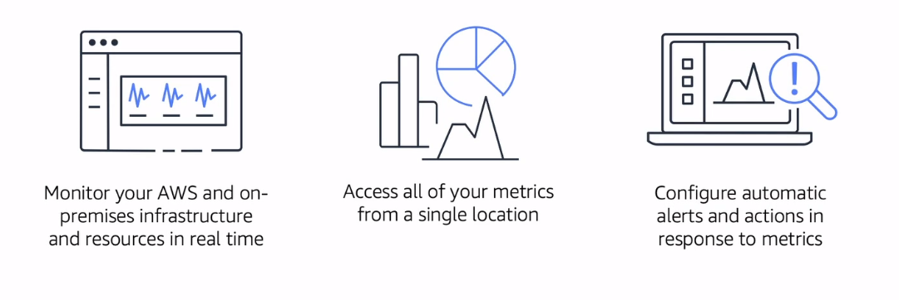

# Monitoring and Analytics

### [Amazon CloudWatch](https://docs.aws.amazon.com/AmazonCloudWatch/latest/monitoring/WhatIsCloudWatch.html)
**Amazon CloudWatch** monitors your Amazon Web Services (AWS) resources and the applications you run on AWS in real time. You can use CloudWatch to collect and track metrics, which are variables you can measure for your resources and applications.

The CloudWatch home page automatically displays metrics about every AWS service you use. You can additionally create custom dashboards to display metrics about your custom applications, and display custom collections of metrics that you choose.

You can create alarms that watch metrics and send notifications or automatically make changes to the resources you are monitoring when a threshold is breached. With CloudWatch, you gain system-wide visibility into resource utilization, application performance, and operational health.

### [AWS CloudTrail](https://docs.aws.amazon.com/awscloudtrail/latest/userguide/cloudtrail-user-guide.html)
**AWS CloudTrail** is an AWS service that helps you enable operational and risk auditing, governance, and compliance of your AWS account. Actions taken by a user, role, or an AWS service are recorded as events in CloudTrail. Events include actions taken in the AWS Management Console, AWS Command Line Interface, and AWS SDKs and APIs.

CloudTrail is enabled on your AWS account when you create it. When activity occurs in your AWS account, that activity is recorded in a CloudTrail event. You can easily view recent events in the CloudTrail console by going to Event history.

### [AWS Trusted Advisor](https://docs.aws.amazon.com/awssupport/latest/user/trusted-advisor.html)
Trusted Advisor draws upon best practices learned from serving hundreds of thousands of AWS customers. Trusted Advisor inspects your AWS environment, and then makes recommendations when opportunities exist to save money, improve system availability and performance, or help close security gaps.

