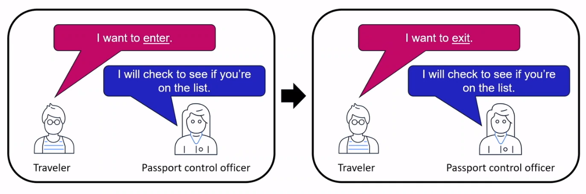

# Network Access Control Lists & Security Groups

## Network Access Control List (NACL)
**Network ACL** helps in providing a firewall thereby helping secure the VPCs and subnets. It helps provide a security layer which controls and efficiently manages the traffic that moves around in the subnets. It is an optional layer for VPC, which adds another security layer to the Amazon service.

Network ACL act as a standard network firewall in any data center. It provides firewall protection at the subnet level, allowing you to filter or allow specific traffic in or out of the subnet. You have full control over both inbound and outbound rules.

### Stateless packet filtering
* Network ACLs perform stateless packet filtering
* Before a packet can exit a subnet, it must be chekced againsts the outbound rules

> 

## Security Group
It controls the incoming and outgoing crowds and operates as a defense border. You may allow more than one such group while initiating instances. While doing this, you have to specify certain protocols for the incoming crowd as well as for the outgoing crowd. Except for these, all other types of crowds are removed. The protocols for the incoming and outgoing crowds can be adjusted as well.

A **security group** is a virtual firewall for an Amazon EC2 instance. By default, a security group denies all inbound and allows all outbound traffic.

### Stateful packet filtering
* Security groups perform stateful packet filtering
* They remember previous decisions that were made for incoming packets

> 

## Security Group vs Network ACL
<table>
  <tbody>
    <tr>
      <th>Security Group</th>
      <th>Network ACL</th>
    </tr>
    <tr>
      <td>Operates at the instance (interface) level</td>
      <td>Operates at the subnet level</td>
    </tr>
    <tr>
      <td>Supports allow rules only</td>
      <td>Supports allow and deny rules</td>
    </tr>
    <tr>
      <td>Stateful</td>
      <td>Stateless</td>
    </tr>
    <tr>
      <td>Evaluates all rules</td>
      <td>Processes rules in order</td>
    </tr>
    <tr>
      <td>Applies to an instance only if associated with a group</td>
      <td>Automatically applies to all instances in the subnets its associated with</td>
    </tr>
  </tbody>
</table>

## Reference
* [AWS Network Access Control List - What are its Components?](https://www.knowledgehut.com/tutorials/aws/aws-nacl)