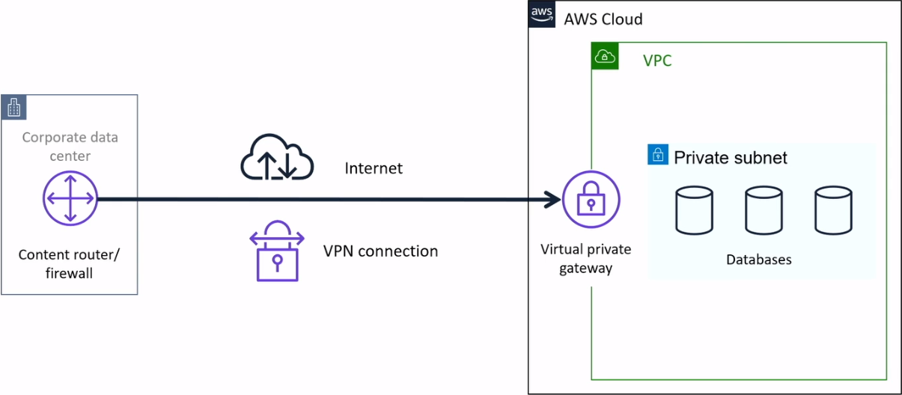
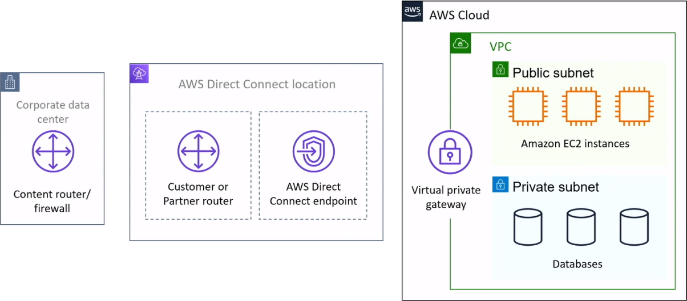

# Networking
A **Network** is a way of communication between devices. AWS Networking allows creating a fast, reliable, and secure network. AWS offers various cloud services that are on-demand, available, and highly scalable. Various AWS services make an AWS network complete, like Amazon VPC, Amazon EC2, Amazon Route 53, Load Balancers, Amazon Gateway, and more.

## Amazon Virtual Private Cloud (Amazon VPC)

**Amazon Virtual Private Cloud (Amazon VPC)** enables you to launch resources in a virtual network you define.

 

Amazon Virtual Private Cloud (VPC) creates a virtual network where developers can launch resources in an isolated section of the AWS cloud. Developers use this tool to enable secure communication between different parts of the cloud network, such as Amazon EC2 instances in different subnets.

A virtual network is a private network that is always hidden from the outside world, and you can perform certain operations that you don't want to make public. Any user with their AWS account can host Amazon VPC. You can create, access, and manage Amazon VPC with the help of certain tools and services like the Amazon Web Service Management Console, Amazon CLI (Command Line Interface), Amazon SDK, and Query API.

**There are three main ways customes connect to AWS**:
* Client VPN
* Site-to-site VPN
* Direct Connect

### Subnet

A subnet is a segment or partition of a VPC's IP address range where you can isolate a group of resources. Subnets define internet accessibility. It can be a *public* or *private*.

 

A **subnet** is a part of the logical cloud where the instances are to be initiated. It makes a collection of the same to provide safety and sound actions. An Internet entryway has to be given as a supplementary for serving the instances to attain the tune-ups.

**Private Subnets**
* No routing table entry to an internet gateway
* Not directly accessible from the public internet

**Types of subnet**
* If a subnet's traffic is routed to an internet gateway, the subnet is known as a **public subnet**.
* If a subnet doesn't have a route to the internet gateway, the subnet is known as a **private subnet**.
* If a subnet doesn't have a route to the internet gateway, but has its traffic routed to a virtual private gateway for a VPN connection, the subnet is known as a **VPN-only subnet**.

### Route Table
It is used to direct traffic with a set of rules called routes.

### Internet Gateway
**Internet Gateway** is the Amazon VPC side of a connection to the public Internet.

### Virtual Private Gateway
A **Virtual Private Gateway** is the VPC endpoint on the Amazon side of your Site-toSite VPN connection that can be attached to a single VPC.

### Structure your Infrastructure

## AWS Direct Connect
AWS Direct Connect helps in establishing a dedicated network from your premises to AWS. It enables a private and secure connection between AWS and the data center. It is compatible with AWS services and supports a high bandwidth for a more consistent network and better speed. The starting speed is around 50 Mbps and supports scaling up to 100 Gbps. This Amazon networking service uses an Ethernet cable to connect an organization's internal workloads to one of AWS' Direct Connect locations.

This connection creates multiple virtual interfaces to Amazon's publicly accessible cloud services or to private resources hosted on AWS. Users can access private and public resources with the same connection while maintaining network separation between the two environments. AWS Direct Connect is particularly useful for organizations with strict governance and compliance rules that require private connectivity.

## Reference
* [What is AWS Networking? - AWS Networking Services](https://intellipaat.com/blog/tutorial/amazon-web-services-aws-tutorial/networking/)
* [A list of AWS networking services cloud users should know](https://www.techtarget.com/searchcloudcomputing/feature/Boost-cloud-connectivity-with-these-Amazon-networking-services)
* [AWS Network Access Control List - What are its Components?](https://www.knowledgehut.com/tutorials/aws/aws-nacl)
* [AWS Networking Fundamentals – A Brief Introduction for Beginners](https://k21academy.com/amazon-web-services/aws-solutions-architect/networking-fundamental/)