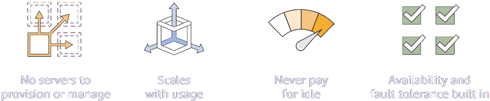
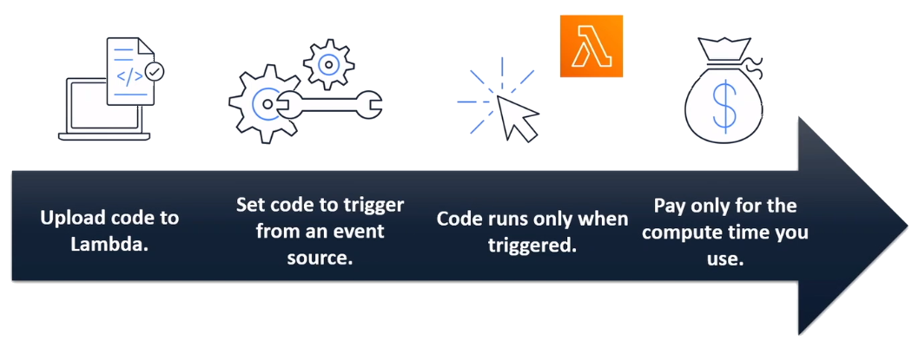

# Serverless Compute Services

### What is serverless computing?
**Serverless** is a cloud-native development model that allows developers to build and run applications without having to manage servers. Serverless differs from other cloud computing models in that the cloud provider is responsible for managing both the cloud infrastructure and the scaling of apps. Serverless apps are deployed in containers that automatically launch on demand when called.

Building and running applications and services without managing servers.

### Serverless Application Use cases

#### Web applications
* Static websites
* Complex web applications
* Packages for Flask and Epxress

### Backends
* Applications and services
* Mobile
* IoT

#### Data processing
* Real time
* MapReduce
* Batch
* Machine learning inference

#### Chatbots
* Powering chatbot logic

### Amazon Alexa
* Powering voice-enabled applications
* Alexa Skills Kit

### IT automation
* Policy engines
* Extending AWS services
* Infrastructure management

## AWS Lambda
* Runs stateless code
* Supports multiple languages
* Fully managed compute service
* Pay only for compute time while code is running
* Run code without provisioning or managing servers
* Runs your code on a schedule or in response to events (for example, changes to data in an Amazon S3 bucket or Amazon DynamoDB table)

### How AWS Lambda works
