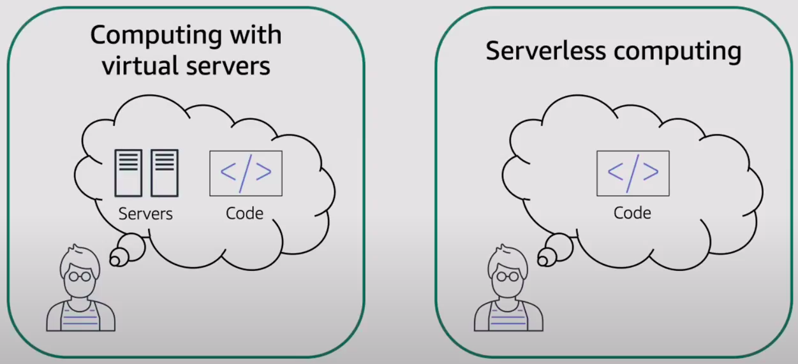

# Serverless Compute Services

### Serverless
**Serverless** is a cloud-native development medol that allows developers to build and run applications without having to manage servers. Serverless differs from other cloud computing models in that the cloud provider is responsible for managing both the cloud infrastructure and the scaling of apps. Serverless apps are deployed in containers that automatically launch on demand when called.

**"No servers to manage"**

## AWS Lambda
* Run code without provisioning or managing servers
* Pay only for compute time while code is running
* Use other AWS services to automatically trigger code