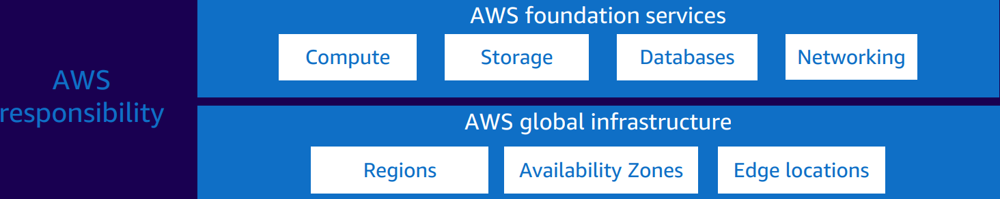

# Security

Security and compliance are shared responsibilities between AWS and the customer. Depending on the services deployed, this shared model can help relieve the customer’s operational burden. This is because AWS operates, manages, and controls the components from the host operating system and virtualization layer down to the physical security of the facilities in which the service operates. The customer assumes responsibility and management of the guest operating system (including updates and security patches) and other associated application software, in addition to the configuration of the AWS-provided security group firewall.

## Customers: Security IN the cloud
 

Examples of customers responsibilites include:
* Instance operating system
* Applications
* Security groups
* Host-based firewalls
* Account management

## AWS: Security OF the cloud
 

Examples of AWS responsibilities include:
* Physical security of data centers
* Hardware and software infrastructure
* Network infrastructure
* Virtualization infrastructure