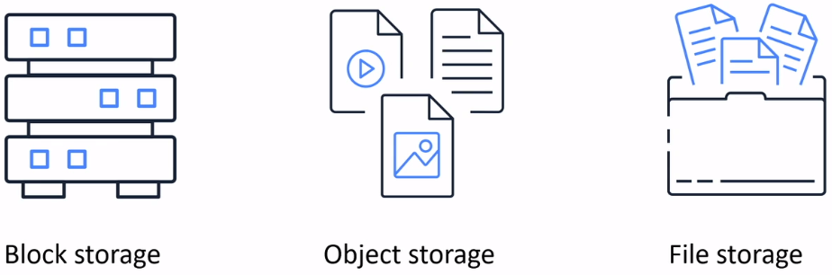
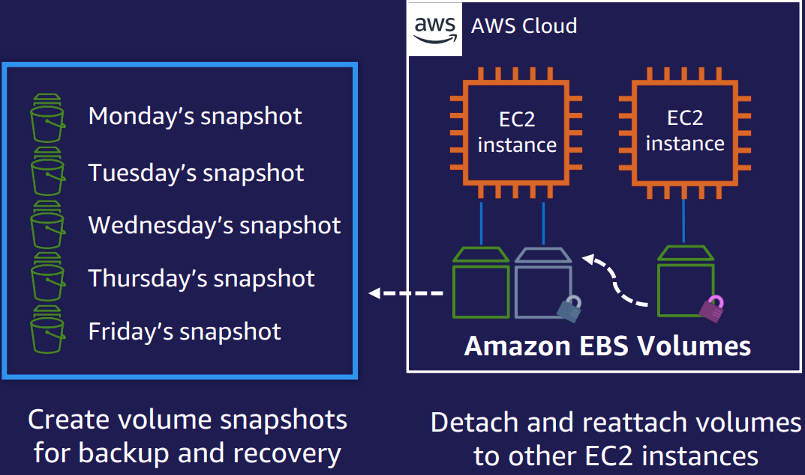
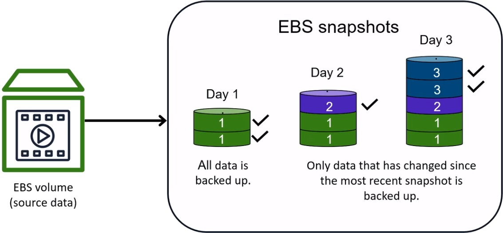
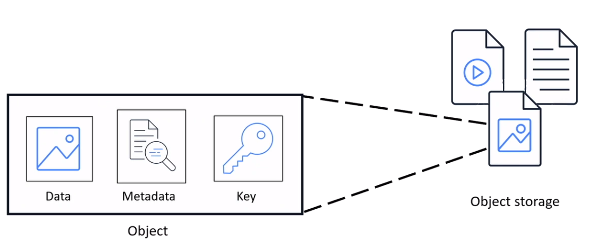
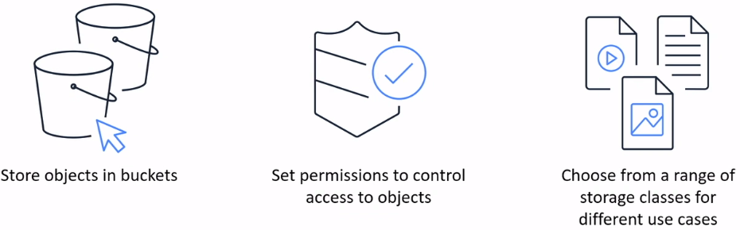
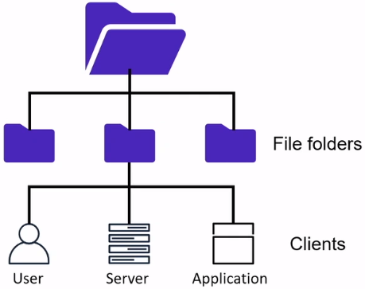

# AWS Storage

### AWS Storage Options
#### Amazon S3
Scalable, highly durable **object storage** in the cloud

#### Amazon S3 Glacier
Low-cost, high durable **archive storage** in the cloud

#### Amazon EBS
Network-attached volumes that provide durable **block-level storage** for Amazon EC2 isntances

#### Amazon EFS
Scalable **network file storage** for Amazon EC2 instances

#### Amazon FSx
Fully managed, **cost-effective file storage** offering the capabilities and performance of popular commercial and open-source file systems

#### AWS Storage Gateway
**Hybrid cloud storage** service that gives you on-premises access to virtually unlimited cloud storage

## Block Storage
In **Block Storage**, files are separated into equal-sized pieces (blocks) of data. It is used for applications that run on Amazon EC2 instances. Other enterprise applications like databases or ERP systems often require dedicated, low latency storage for every host. this is often analogous to direct-attached storage (DAS) or a cargo area Network (SAN). Block-based cloud storage solutions like Elastic Block Store (Amazon EBS) and EC2 Instance Storage.

### Instance store

### Amazon Elastic Block Store (Amazon EBS)
* Persistent block storage for instances
* Protected through replication
* Different drive types
* Scale up or down in minutes
* Pay for only what you provision
* Snapshot functionality
* Encryption available

#### Amazon EBS Volumes
**Elastic Block Storage Volumes** are network file systems. Volumes get automatically replicated within Availability Zones for high availability and durability. EBS is closer to locally attached disk whether that be IDE, SAS, SCSI (or it's close cousin iSCSI/Fibre Channel, which is in reality just SCSI over a pipe). With Locally attached disk you have better responsiveness and addressing. This allows you to use File Systems that can address the disk at a block level. This includes part reads, part writes, read ahead, delayed writes, file system maintenance where you swap block under the file, block level cloning, thin provisioning, deduplication etc. 

#### Amazon EBS Snapshots

## Object Storage
Applications developed within the cloud often cash in on object storage’s vast scalability and metadata characteristics. Object storage solutions like  Simple Storage Service (Amazon S3) and Amazon Glacier are ideal for building modern applications from scratch that need scale and adaptability, and may even be wont to import existing data stores for analytics, backup, or archive.

### Amazon Simple Storage Service (S3)
**Amazon S3** the oldest and most supported storage platform of AWS uses an object storage model that is built to store and retrieve any amount of data. Data can be accessed everywhere such as websites, mobile apps, corporate applications, and data from IoT sensors or devices that can be dumped onto S3. You cannot interact with the contents of the object until you have extracted the object from S3  (`GET`). It cannot be edited in-place, you must extract it, change it, and them put it back to replace the original (`PUT`). What this comes down to is that here is no user "locking" functionality as might be offered by a 'file system' This is why it is called "Object storage".

* Object-level storage
* Designed for 99.999999999% durability
* Event triggers

#### Use Cases
* Content storage distribution
* Backup and archiving
* Big data analytics
* Disaster recovery
* Static website hosting

#### Amazon S3 Storage Classes

**S3 Standard**
* Designed for frequently accessed data
* Stores data in a minimum of three Availability zones

**S3 Standard-IA**
* Ideal for infrequently accessed data
* Similar to S3 Standard but has a lower storage price and higher retrieval price

**S3 One Zone-IA**
* Stores dat ain a single Availability Zone
* Has a lower storage price than S3 Standard-IA

**S3 Intelligent-Tiering**
* Ideal for data with unknown or changing access patterns
* Requires small monthly monitoring and automation fee per object

**S3 Glacier**
* Low-cost storge designed for data archiving
* Able to retrieve objects within a few minutes to hours

**S3 Glacier Deep Archive**
* Lowest-cost object storage class
* Able to retrieve objects within 12 hours

## File Storage
In **File storage**, multiple clients can access data that is stored in file folders. Many applications got to access shared files and need a filing system. this sort of storage is usually supported with a Network Attached Storage (NAS) server. File storage solutions like *Elastic File System (Amazon EFS)* are ideal to be used in cases like large content repositories, development environments, media stores, or user home directories.

### Use Cases
#### Amazon Elastic File System (EFS)
* Simplify Development Operations (DevOps)
* Modernize application development
* Enhance content management systems
* Accelerate data science

#### Amazon FSx for Lustre
* Accelerate machine learning
* Enable high performance computing
* Unloc big data analytics
* Increase media workload agility

#### Amazon FSx for Windows
* Migrate Windows file servers to AWS
* Accelerate hybrid workloads
* Reduce Microsoft SQL server deployment cost
* Simplify virtual desktops and streaming

## Reference
* [AWS Storage Types - S3, EFS, & EBS](https://help.acloud.guru/hc/en-us/articles/115002011194-AWS-Storage-Types-S3-EFS-EBS)
* [AWS Storage: Overview, Types & Benefits](https://k21academy.com/amazon-web-services/aws-solutions-architect/aws-storage-overview-types-benefits/)