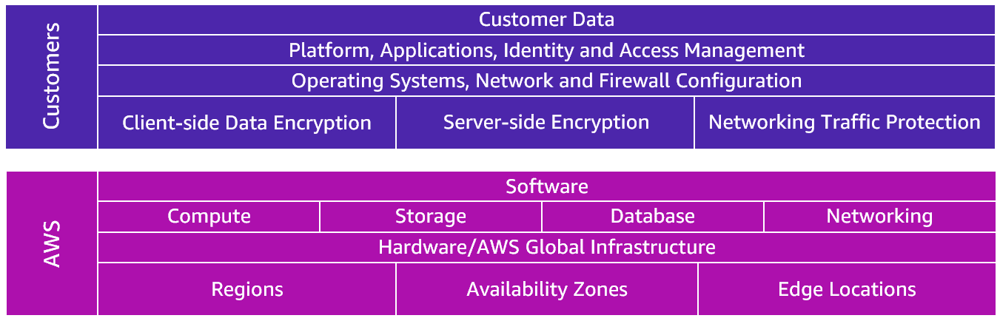

# Security and the AWS Shared Responsibility Model

When you work with the AWS Cloud, managing security and compliance is a shared responsibility between AWS and you. To depict this shared responsibility, AWS created the shared responsibility model. The distinction of responsibility is commonly referred to as security OF the cloud versus security IN the cloud.

Below are examples of controls that are managed by AWS, AWS Customers and/or both.

**Inherited Controls** – Controls which a customer fully inherits from AWS.
* Physical and Environmental controls

**Shared Controls** – Controls which apply to both the infrastructure layer and customer layers, but in completely separate contexts or perspectives. In a shared control, AWS provides the requirements for the infrastructure and the customer must provide their own control implementation within their use of AWS services. Examples include:
* Patch Management – AWS is responsible for patching and fixing flaws within the infrastructure, but customers are responsible for patching their guest OS and applications.
* Configuration Management – AWS maintains the configuration of its infrastructure devices, but a customer is responsible for configuring their own guest operating systems, databases, and applications.
* Awareness & Training - AWS trains AWS employees, but a customer must train their own employees.

**Customer Specific** – Controls which are solely the responsibility of the customer based on the application they are deploying within AWS services. Examples include:
* Service and Communications Protection or Zone Security which may require a customer to route or zone data within specific security environments.

## AWS Responsibility
AWS is responsible for *security of the cloud*. This means AWS protects and secures the infrastructure that runs the services offered in the AWS Cloud. AWS is responsible for:

* Protecting and securing AWS Regions, Availability Zones, and data centers, down to the physical security of the buildings
* Managing the hardware, software, and networking components that run AWS services, such as the physical servers, host operating systems, virtualization layers, and AWS networking components

The level of responsibility AWS has depends on the service. AWS classifies services into three categories.
* **Infrastructure services**

   AWS manages the underlying infrastructure and foundation services.

* **Container services**

   AWS manages the underlying infrastructure and foundation services, operating system, and application platform. 

* **Abstracted services**

   AWS operates the infrastructure layer, operating system, and platforms, in addition to server-side encryption and data protection.

## Customer Responsibility
Customers are responsible for *security in the cloud*. When using any AWS service, you’re responsible for properly configuring the service and your applications, in addition to ensuring that your data is secure. Using the three categories of AWS services, you can determine your level of responsibility for each AWS service you use.

* **Infrastructure services**

   You control the operating system and application platform, in addition to encrypting, protecting, and managing customer data. 

* **Container services**

   You are responsible for customer data, encrypting the data, and protecting it through network firewalls and backups.

* **Abstracted services**

   You are responsible for managing customer data and protecting it through client-side encryption.

A key concept is that customers maintain complete control of their data and are responsible for managing the security related to their content. For example, you are responsible for the following:
* Choosing a Region for AWS resources in accordance with data sovereignty regulations
* Implementing data-protection mechanisms, such as encryption and scheduled backups
* Using access control to limit who can access to your data and AWS resources

Customers are responsible for managing their data (including encryption options), classifying their assets, and using IAM tools to apply the appropriate permissions.

## Resources
* [Shared Responsibility Model](https://aws.amazon.com/compliance/shared-responsibility-model/)