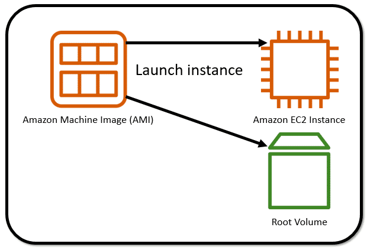

# Amazon Elastic Compute Cloud

**Amazon EC2** is a web service that provides secure, resizable compute capacity in the cloud. It allows you to provision virtual servers called EC2 instances. Although AWS uses the phrase “web service” to describe it, you are not limited to running just web servers on your EC2 instances.

To create an EC2 instance, you must define the following:
* Hardware specifications, like CPU, memory, network, and storage
* Logical configurations, like networking location, firewall rules, authentication, and the operating system of your choice

When launching an EC2 instance, the first setting you configure is which operating system you want by selecting an Amazon Machine Image (AMI).

### Amazon Machine Image
In the traditional infrastructure world, the process of spinning up a server consists of installing an operating system from installation disks, installation drives, or installation wizards over the network. In the AWS Cloud, the operating system installation is not your responsibility. Instead, it's built into the AMI that you choose.

In addition, when you use an AMI, you can select storage mappings, the architecture type (such as 32-bit, 64-bit, or 64-bit ARM), and additional software installed.

## Relationship between AMIs and EC2 instances
EC2 instances are live instantiations of what is defined in an AMI, much like a cake is a live instantiation of a cake recipe. If you are familiar with software development, you can also see this kind of relationship between a class and an object.

A class is something you model and define, while an object is something you interact with. In this case, the AMI is how you model and define your instance, while the EC2 instance is the entity you interact with, where you can install your web server and serve your content to users.

When you launch a new instance, AWS allocates a virtual machine that runs on a hypervisor. Then, the AMI you selected is copied to the root device volume, which contains the image used to boot the volume. In the end, you get a server that you can connect to and install packages and additional software on.

One advantage of using AMIs is that they are reusable. You might choose a Linux-based AMI and configure the HTTP server, application packages, and additional software you need to run your application. If you want to create a second EC2 instance with the same configurations, you could go through the entire instance creation and configuration process to match your settings to the first instance. Or, you could create an AMI from your running instance and use the AMI to start a new instance. That way, your new instance would have the same configurations as your current instance, because the configurations set in the AMIs are the same.

## Find AMIs
You can select an AMI from the following categories:

* Quick Start AMIs, which are created by AWS to help you get started quickly
* AWS Marketplace AMIs, which provide popular open source and commercial software from third-party vendors
* My AMIs, which are created from your EC2 instances
* Community AMIs, which are provided by the AWS user community
* Build your own custom image with EC2 Image Builder

Each AMI in the AWS Management Console has an AMI ID, which is prefixed by “ami-”, followed by a random hash of numbers and letters. The IDs are unique to each AWS Region.

## Resources
* [Amazon EC2](https://aws.amazon.com/ec2/)
* [Amazon Machine Images (AMI)](https://docs.aws.amazon.com/AWSEC2/latest/UserGuide/AMIs.html)
* [Creating an Amazon EBS-backed Linux AMI](https://docs.aws.amazon.com/AWSEC2/latest/UserGuide/creating-an-ami-ebs.html)
* [What Is EC2 Image Builder?](https://docs.aws.amazon.com/imagebuilder/latest/userguide/what-is-image-builder.html)