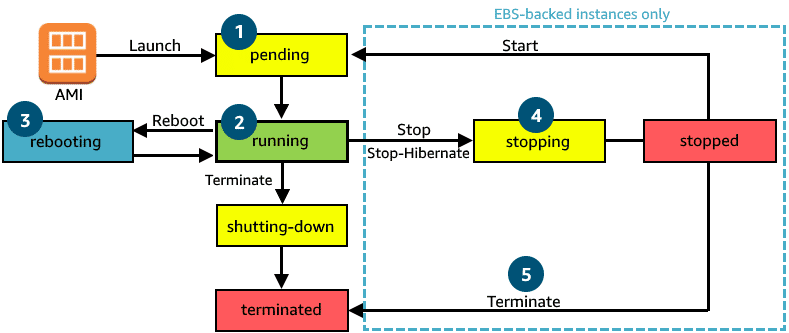

# Amazon EC2 Instance Lifecycle
An Amazon EC2 instance transitions through different states from the moment you launch it through to its termination.

| **Instance state**      | **Description** | **Instance usage billing** |
| ----------------------- | --------------- | ---------------------- |
| **`pending`**       | The instance is preparing to enter the `running` state. An instance enters the `pending` state when it launches for the first time, or when it is started after being in the `stopped` state. | Not billed |
| **`running`**       | The instance is running and ready for use.                                             | Billed |
| **`stopping`**      | The instance is preparing to be stopped or stop-hibernated.                            | Not billed if preparing to stop  Billed if preparing to hibernate |
| **`stopped`**       | The instance is shut down and cannot be used. The instance can be started at any time. | Not billed |
| **`shutting-down`** | The instance is preparing to be terminated.                                            | Not billed |
| **`terminated`**    | The instance has been permanently deleted and cannot be started.                       | Not billed  Note  Reserved Instances that applied to terminated instances are billed until the end of their term according to their payment option. |

## Amazon EC2 instance types
Amazon EC2 instances are a combination of virtual processors (vCPUs), memory, network, and, in some cases, instance storage and graphics processing units (GPUs). When you create an EC2 instance, you need to choose how much you need of each of these components.

AWS offers a variety of instances that differ based on performance. Some instances provide more capacity than others. To get an overview of the capacity details for a particular instance, you should look at the instance type. **Instance types** consist of a prefix identifying the type of workloads they’re optimized for, followed by a size. For example, the instance type c5.large can be broken down as follows:

* **c5** determines the instance family and generation number. Here, the instance belongs to the fifth generation of instances in an instance family that’s optimized for generic computation.
* **large** determines the amount of instance capacity.

## Instance families
Each instance family is optimized to fit different use cases. The following table describes instance families and some typical workloads.

| **Instance Family** | **Description** | **Use Cases** |
| :-----------------: | :-------------: | :-----------: |
| General purpose | Provides a balance of compute, memory, and networking resources, and can be used for a variety of workloads. | Scale out workloads, such as web servers, containerized microservices, caching fleets, distributed data stores, and development environments |
| Compute optimized | Ideal for compute-bound applications that benefit from high-performance processors. | High-performance web servers, scientific modeling, batch processing, distributed analytics, high-performance computing (HPC), machine/deep learning, ad serving, highly scalable multiplayer gaming |
| Memory optimized | Designed to deliver fast performance for workloads that process large datasets in memory. | Memory-intensive applications, such as high-performance databases, distributed web-scale in-memory caches, mid-size in-memory databases, real-time big-data analytics, and other enterprise applications |
| Accelerated computing | Use hardware accelerators or co-processors to perform functions such as floating-point number calculations, graphics processing, or data pattern matching more efficiently than is possible with conventional CPUs. | 3D visualizations, graphics-intensive remote workstations, 3D rendering, application streaming, video encoding, and other server-side graphics workloads |
| Storage optimized | Designed for workloads that require high, sequential read and write access to large datasets on local storage. They are optimized to deliver tens of thousands of low-latency random I/O operations per second (IOPS) to applications that replicate their data across different instances. | NoSQL databases, such as Cassandra, MongoDB, and Redis, in-memory databases, scale-out transactional databases, data warehousing, Elasticsearch, and analytics |                                      |

## EC2 instance locations
By default, your EC2 instances are placed in a network called the default **Amazon Virtual Private Cloud (Amazon VPC)**. This network was created so that you can easily get started with Amazon EC2 without learning how to create and configure a VPC.

Any resource you put inside the default VPC will be public and accessible by the internet, so you shouldn’t place any customer data or private information in it.

Once you get more comfortable with networking on AWS, you should change this default setting to choose your own custom VPCs and restrict access with additional routing and connectivity mechanisms.

## Architect for high availability
In the network, your instance resides in an Availability Zone of your choice. As you learned previously, AWS services that are scoped at the Availability Zone level must be architected with high availability in mind.

While EC2 instances are typically reliable, two is better than one, and three is better than two. Specifying the instance size gives you an advantage when designing your architecture because you can use more smaller instances rather than a few larger ones.

## EC2 instance lifecycle
An EC2 instance transitions between different states from the moment you create it until it's termination.

1. When you launch an instance, it enters the **pending** state. When an instance is pending, billing has not started. At this stage, the instance is preparing to enter the running state. Pending is where AWS performs all actions needed to set up an instance, such as copying the AMI content to the root device and allocating the necessary networking components.
2. When your instance is **running**, it's ready to use. This is also the stage where billing begins. As soon as an instance is running, you can take other actions on the instance, such as reboot, terminate, stop, and stop-hibernate.
3. When you reboot an instance, it’s different than performing a stop action and then a start action. **Rebooting** an instance is equivalent to rebooting an operating system. The instance remains on the same host computer, and maintains its public and private IP address, in addition to any data on its instance store.
4. It typically takes a few minutes for the reboot to complete. When you stop and start an instance, your instance may be placed on a new underlying physical server. Therefore, you lose any data on the instance store that were on the previous host computer. When you stop an instance, the instance gets a new public IP address but maintains the same private IP address.
5. When you terminate an instance, the instance stores are erased, and you lose both the public IP address and private IP address of the machine. Termination of an instance means that you can no longer access the machine.

## Difference between stop and stop-hibernate
When you stop an instance, it enters the stopping state until it reaches the stopped state. AWS does not charge usage or data transfer fees for your instance after you stop it, but storage for any Amazon EBS volumes is still charged. While your instance is in the stopped state, you can modify some attributes, like the instance type. When you stop your instance, the data stored in memory (RAM) is lost.

When you stop-hibernate an instance, AWS signals the operating system to perform hibernation (suspend-to-disk), which saves the contents from the instance memory (RAM) to the Amazon EBS root volume.

## Pricing
One of the ways to reduce costs with Amazon EC2 is to choose the right pricing option for the way your applications run. AWS offers three main purchasing options for EC2 instances – On-Demand, Reserved, and Spot Instances.

### Pay as you go with On-Demand Instances
With On-Demand Instances, you pay for compute capacity with no long-term commitments. Billing begins whenever the instance is running, and billing stops when the instance is in a stopped or terminated state. The price per second for a running On-Demand Instance is fixed.

For applications that require servers to be running all the time, you are less likely to benefit from the On-Demand pricing model, simply because there is no situation where you will need to turn servers off. In the case when servers cannot be stopped, consider using a Reserved Instance to save on costs.

### Reserve capacity with Reserved Instances (RIs)
RIs provide you with a significant discount compared to On-Demand Instance pricing. RIs provide a discounted hourly rate and an optional capacity reservation for EC2 instances. You can choose between three payment options – ***All Upfront***, ***Partial Upfront***, or ***No Upfront***. You can select either a 1-year or 3-year term for each of these options.

Depending on which option you choose, you are discounted differently.
* **All Upfront** offers a higher discount than Partial Upfront instances.
* **Partial Upfront** instances offer a higher discount than No Upfront.
* **No Upfront** offers a higher discount than On-Demand.

On-Demand and No Upfront are similar, since both do not require any upfront payment. However, there is a major difference. When you choose an On-Demand Instance, you stop paying for the instance when you stop or terminate the instance. When you stop an RI, you still pay for it because you committed to a 1-year or 3-year term.

Reserved Instances are associated with an instance type and an Availability Zone depending on how you reserve it. The discount applied by a Reserved Instance purchase is not directly associated with a specific instance ID, but with an instance type.

### Save on costs with Spot Instances
Another way to pay for EC2 instances is by using Spot Instances. Amazon EC2 Spot Instances allow you to take advantage of unused EC2 capacity in the AWS Cloud. They are available at up to a 90% discount compared to On-Demand prices.

With Spot Instances, you set a limit on how much you would like to pay for the instance hour. This is compared against the current Spot price that AWS determines. If the amount you pay is more than the current Spot price and there is capacity, then you will receive an instance. While they are very promising from the billing perspective, you must account for some architectural considerations to use them effectively.

## Resources
* [Amazon EC2](https://aws.amazon.com/ec2/)
* [Default VPC and Default Subnets](https://docs.aws.amazon.com/vpc/latest/userguide/default-vpc.html)
* [AWS Reliability Pillar (PDF)](https://d1.awsstatic.com/whitepapers/architecture/AWS-Reliability-Pillar.pdf)
* [Instance Lifecycle](https://docs.aws.amazon.com/AWSEC2/latest/UserGuide/ec2-instance-lifecycle.html)
* [Amazon EC2 Pricing](https://aws.amazon.com/ec2/pricing/)
* [Amazon EC2 On-Demand Pricing](https://aws.amazon.com/ec2/pricing/on-demand/)
* [Amazon EC2 Spot Instances Pricing](https://aws.amazon.com/ec2/spot/pricing/)
* [Amazon EC2 Reserved Instances Pricing](https://aws.amazon.com/ec2/pricing/reserved-instances/pricing/)