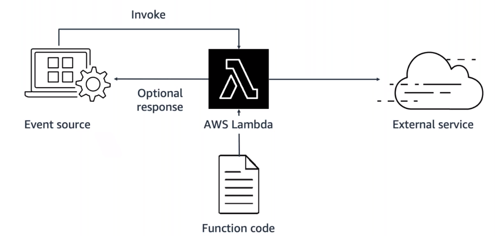

# AWS Lambda

AWS Lambda is a serverless, event-driven compute service that lets you run code for virtually any type of application or backend service without provisioning or managing servers. You can trigger Lambda from over 200 AWS services and software as a service (SaaS) applications, and only pay for what you use.

> 

## Go serverless
Every definition of serverless mentions the following four aspects:
* No servers to provision or manage
* Scales with usage
* You never pay for idle resources
* Availability and fault tolerance are built-in

With serverless, you can spend time on the things that differentiate your application, rather than spending time on ensuring availability, scaling and managing servers.

AWS has several serverless compute options, including AWS Fargate and AWS Lambda.

## Explore serverless containers with AWS Fargate
Amazon ECS and Amazon EKS enable you to run your containers in the following two modes:
* Amazon EC2 mode
* Amazon Fargate mode

**AWS Fargate** is a purpose-built serverless compute engine for containers. Fargate scales and manages the infrastructure, allowing developers to work on what they do best - application development. It achieves this by allocating the right amount of compute, eliminating the need to choose and handle EC2 instances and cluster capacity, and scaling. Fargate supports both Amazon ECS and Amazon EKS architecture, and provides workload isolation and improved security by design.

Fargate abstracts the EC2 instances so that you're not required to manage it. However, with Fargate, you can use all the same ECS primitives, APIs, and APIs, and AWS integrations. It natively integrates with AWS Identity and Access Management (IAM) and Amazon Virtual Private Cloud (VPC). Having native integration with Amazon VPC allows you to launch Fargate containers inside your network and control connectivity to your applications.

## Run code on AWS Lambda
If you want to deploy your workloads and applications without having to manage any EC2 instances or containers, you can use AWS Lambda.

With AWS Lambda, you can run code without provisioning or managing servers or containers. You can run code for virtually any type of application or backend service, including data processing, real-time stream processing, machine learning, WebSockets, IoT backends, mobile backends, and web apps, like your corporate directory app!

AWS Lambda requires zero administration from the user. You upload your source code, and Lambda takes care of everything required to run and scale your code with high availability. There are no servers to manage, bringing you continuous scaling with subsecond metering and consistent performance.

## How AWS Lambda works
A Lambda function has three primary components – **trigger**, **code**, and **configuration**.

> 

The **code** is source code that describes what the Lambda function should run. It can be authored in three ways.
* You create the code from scratch.
* You use a blueprint that AWS provides.
* You use some code from the AWS Serverless Application Repository, a resource that contains sample applications, such as “hello world” code, Amazon Alexa Skill sample code, image resizing code, video encoding, and more.

When you create your Lambda function, you specify the runtime you want your code to run in. You can use built-in runtimes, such as Python, Node.js, Ruby, Go, Java, or .NET Core, or you can implement your Lambda functions to run on a custom runtime.

The configuration of a Lambda function consists of information that describes how the function should run. In the configuration, you specify network placement, environment variables, memory, invocation type, permission sets, and other configurations.

**Triggers** describe when a Lambda function should run. A trigger integrates your Lambda function with other AWS services, enabling you to run your Lambda function in response to certain API calls that occur in your AWS account. This increases your ability to respond to events in your console without having to perform manual actions. All you need is the what, how, and when of a Lambda function to have functional compute capacity that runs only when you need it to.

Amazon’s CTO, Werner Vogels, says, *“No server is easier to manage than no server.”* This quote summarizes the convenience you can have when running serverless solutions, like AWS Fargate and AWS Lambda.

## AWS Lambda function handler
The **AWS Lambda function handler** is the method in your function code that processes events. When your function is invoked, Lambda runs the handler method. When the handler exits or returns a response, it becomes available to handle another event.

Example:
```python
def handler_name(event, context):
...
return some_value
```

### Naming
The **Lambda function handler name** specified at the time you create a Lambda function is derived from the following:

* Name of the file in which the Lambda handler function is located
* Name of the Python handler function

A function handler can be any name; however, the default on the Lambda console is `lambda_function.lambda_handler`. This name reflects the function name as `lambda_handler`, and the file where the handler code is stored in `lambda_function.py`. If you choose a different name for your function handler on the Lambda console, you must update the name on the Runtime settings pane.

## Billing granularity
AWS Lambda lets you run code without provisioning or managing servers, and you pay only for what you use. You are charged for the number of times your code is triggered (requests) and for the time your code executes, rounded up to the nearest 1 ms (duration).

AWS rounds up duration to the nearest millisecond with no minimum execution time. With this pricing, it can be cost effective to run functions whose execution time is very low, such as functions with durations under 100 ms or low latency APIs.

## Reference
* [Serverless](https://aws.amazon.com/serverless/)
* [Building Modern Python Applications on AWS](https://www.coursera.org/learn/building-modern-python-applications-on-aws)
* [AWS Serverless Resources](https://aws.amazon.com/serverless/resources/?serverless.sort-by=item.additionalFields.createdDate&serverless.sort-order=desc)
* [Building Applications with Serverless Architectures](https://aws.amazon.com/lambda/serverless-architectures-learn-more/)
* [Best Practices for Organizing Larger Serverless Applications](https://aws.amazon.com/blogs/compute/best-practices-for-organizing-larger-serverless-applications/)
* [Managing AWS Lambda Functions](https://docs.aws.amazon.com/lambda/latest/dg/lambda-functions.html)
* [10 Things Serverless Architects Should Know](https://aws.amazon.com/blogs/architecture/ten-things-serverless-architects-should-know/)
* [AWS Alien Attack! A Serverless Adventure](https://alienattack.workshop.aws/)
* [News for AWS Lambda - 1ms Billing Granularity Adds Cost Savings](https://aws.amazon.com/blogs/aws/new-for-aws-lambda-1ms-billing-granularity-adds-cost-savings/)