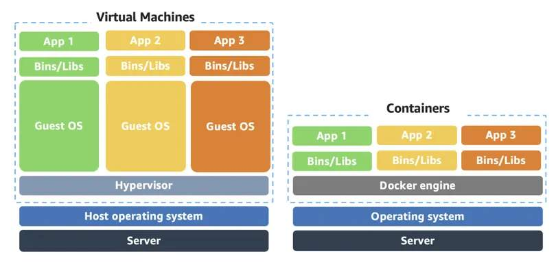
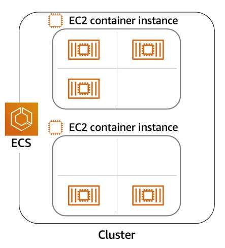
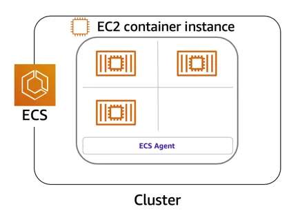

# Container Services
The three main categories of compute are *virtual machines (VMs)*, *containers*, and *serverless*. No one-size-fits-all compute service exists because it depends on your needs. **Containers** can host a variety of different workloads, including web applications, lift and shift migrations, distributed applications, and streamlining of development, test, and production environments.

## Containers
While containers are often referred to as a new technology, the idea started in the 1970s with certain UNIX kernels having the ability to separate their processes through isolation. At the time, this was configured manually, making operations complex.

With the evolution of the open source software community, containers evolved. Today, containers are used as a solution to problems of traditional compute, including the issue of getting software to run reliably when it moves from one compute environment to another.

A **container** is a standardized unit that packages your code and its dependencies. This package is designed to run reliably on any platform, because the container creates its own independent environment. With containers, workloads can be carried from one place to another, such as from development to production or from on premises to the cloud.

## [Docker](https://www.docker.com/)
Docker is a popular container runtime that simplifies the management of the entire operating system stack needed for container isolation, including networking and storage. Docker helps customers create, package, deploy, and run containers.

### Difference between containers and virtual machines (VMs)

**Containers** share the same operating system and kernel as the host they exist on, whereas **virtual machines** contain their own operating system. Each virtual machine must maintain a copy of an operating system, which results in a degree of wasted resources.

A container is more lightweight. They spin up quicker, almost instantly. This difference in startup time becomes instrumental when designing applications that need to scale quickly during input/output (I/O) bursts.

While containers can provide speed, virtual machines offer the full strength of an operating system and more resources, like package installation, dedicated kernel, and more.

## Orchestrate containers
In AWS, containers run on EC2 instances. For example, you might have a large instance and run a few containers on that instance. While running one instance is easy to manage, it lacks high availability and scalability. Most companies and organizations run many containers on many EC2 instances across several Availability Zones.

If you’re trying to manage your compute at a large scale, you must know the following:
* How to place your containers on your instances
* What happens if your container fails
* What happens if your instance fails
* How to monitor deployments of your containers

This coordination is handled by a container orchestration service. AWS offers two container orchestration services – *Amazon Elastic Container Service (ECS)* and *Amazon Elastic Kubernetes Service (EKS)*.

## Manage containers with Amazon Elastic Container Service (Amazon ECS)
Amazon ECS is an end-to-end container orchestration service that helps you spin up new containers and manage them across a cluster of EC2 instances.

To run and manage your containers, you need to install the Amazon ECS container agent on your EC2 instances. This agent is open source and responsible for communicating to the Amazon ECS service about cluster management details. You can run the agent on both Linux and Windows AMIs. An instance with the container agent installed is often called a **container instance**.

Once the Amazon ECS container instances are up and running, you can perform actions that include, but are not limited to, launching and stopping containers, getting cluster state, scaling in and out, scheduling the placement of containers across your cluster, assigning permissions, and meeting availability requirements.

To prepare your application to run on Amazon ECS, you create a task definition. The **task definition** is a text file, in JSON format, that describes one or more containers. A task definition is similar to a blueprint that describes the resources you need to run a container, such as CPU, memory, ports, images, storage, and networking information.

## Use Kubernetes with Amazon Elastic Kubernetes Service (Amazon EKS)
[**Kubernetes**](https://kubernetes.io/) is a portable, extensible, open source platform for managing containerized workloads and services. By bringing software development and operations together by design, Kubernetes created a rapidly growing ecosystem that is very popular and well established in the market.

If you already use Kubernetes, you can use Amazon EKS to orchestrate the workloads in the AWS Cloud. Amazon EKS is conceptually similar to Amazon ECS, but with the following differences:
* An EC2 instance with the ECS agent installed and configured is called a container instance. In Amazon EKS, it is called a **worker node**.
* An ECS container is called a task. In Amazon EKS, it is called a **pod**.
* While Amazon ECS runs on AWS native technology, Amazon EKS runs on top of Kubernetes.

If you have containers running on Kubernetes and want an advanced orchestration solution that can provide simplicity, high availability, and fine-grained control over your infrastructure, Amazon EKS could be the tool for you.

## Resources
* [Containers on AWS](https://aws.amazon.com/containers/services/)
* [What Is a Container?](https://www.docker.com/resources/what-container)
* [Amazon Elastic Container Service](https://aws.amazon.com/ecs/)
* [Amazon ECS Agent](https://github.com/aws/amazon-ecs-agent)
* [Amazon ECS ContainerInstances](https://docs.aws.amazon.com/AmazonECS/latest/developerguide/ECS_instances.html)
* [Building Containerized Applications on AWS](https://www.coursera.org/learn/containerized-apps-on-aws)