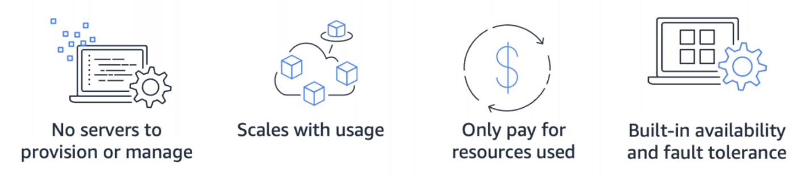

# Serverless

> 

**Serverless** allows you to build and run applications and services without thinking about servers. It eliminates infrastructure management tasks such as server or cluster provisioning, patching, operating system maintenance, and capacity provisioning. Serverless applications are event-driven and loosely coupled via technology-agnostic APIs or messaging. Event-driven code is executed in response to an event, such as a change in state or an endpoint request. Event-driven architectures decouple code from state. Integration between loosely couple components is usually done asynchronously, with messaging.

***AWS Lambda*** is a serverless compute service that is well suited to event-driven architectures. Lambda functions are triggered by events via integrated event sources such as Amazon Simple Queue Service (SQS), Amazon Simple Notification Service (SNS), and Amazon Kinesis that can be used to create asynchronous integrations. Lambda functions consume and produce events that other services can then consume.

## Why use serverless?
**No server management**: There is no need to provision or maintain any servers. There is no software or runtime to install, maintain, or administer.

**Flexible scaling**: Your application can be scaled automatically or by adjusting its capacity through toggling the units of consumption (e.g. throughput, memory) rather than units of individual servers.

**Pay for value**: Pay for consistent throughput or execution duration rather than by server unit.

**Automated high availability**: Serverless provides built-in availability and fault tolerance. You don't need to architect for these capabilities since the services running the application provide them by default.

## What is a serverless architecture?
A serverless architecture is a way to build and run applications and services without having to manage infrastructure. Your application still runs on servers, but all the server management is done by AWS. You no longer have to provision, scale, and maintain servers to run your applications, databases, and storage systems.

## Reference
* [Deep Dive Serverless](https://aws.amazon.com/getting-started/deep-dive-serverless/)
* [Building Applications with Serverless Architectures](https://aws.amazon.com/lambda/serverless-architectures-learn-more/)