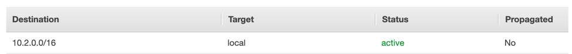
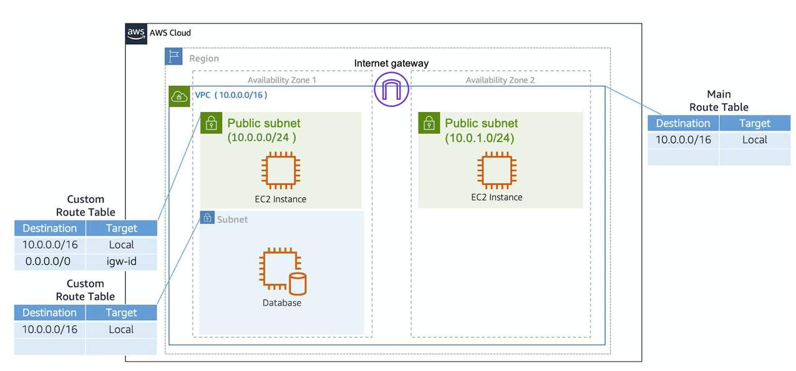

# Amazon VPC Routing

A ***route table*** contains a set of rules, called *routes*, that are used to determine where network traffic from your subnet or gateway is directed. To put it simply, a route table tells network packets which way they need to go to get to their destination.

### Main Route Table
When you create a VPC, AWS creates a route table called the main route table. A **route table** contains a set of rules, called routes, that are used to determine where network traffic is directed. AWS assumes that when you create a new VPC with subnets, you want traffic to flow between them. Therefore, the default configuration of the main route table is to allow traffic between all subnets in the local network. Below is an example of a main route table.

The destination and target are two main parts of this route table.
* The **destination** is a range of IP addresses where you want your traffic to go. In the example of sending a letter, you need a destination to route the letter to the appropriate place. The same is true for routing traffic. In this case, the destination is the VPC network's IP range.
* The **target** is the connection through which to send the traffic. In this case, the traffic is routed through the local VPC network.

### Custom route tables
While the main route table is used implicitly by subnets that do not have an explicit route table association, you might want to provide different routes on a per-subnet basis, for traffic to access resources outside of the  VPC. For example, your application might consist of a front end and a database. You can create separate subnets for the resources and provide different routes for each of them.

If you associate a custom route table with a subnet, the subnet will use it instead of the main route table. Each custom route table you create will have the local route already inside it, allowing communication to flow between all resources and subnets inside the VPC. The local route cannot be deleted.

## Good Read
* [Configure route tables](https://docs.aws.amazon.com/vpc/latest/userguide/VPC_Route_Tables.html)
* [AWS — VPC Route Table Overview](https://medium.com/awesome-cloud/aws-vpc-route-table-overview-intro-getting-started-guide-5b5d65ec875f)