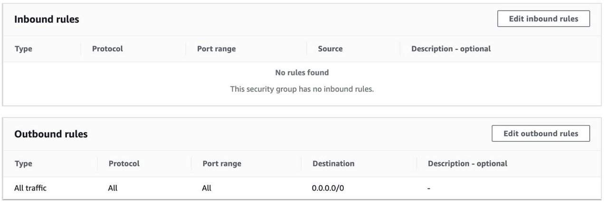
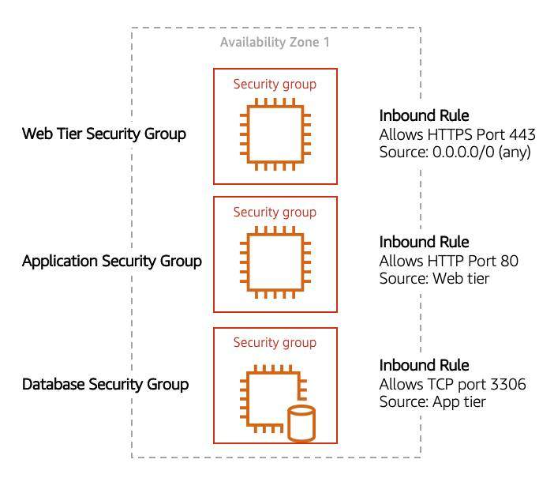

# Amazon VPC Security

A ***network access control list (ACL)*** allows or denies specific inbound or outbound traffic at the subnet level. You can use the default network ACL for your VPC, or you can create a custom network ACL for your VPC with rules that are similar to the rules for your security groups in order to add an additional layer of security to your VPC.

A ***security group*** controls the traffic that is allowed to reach and leave the resources that it is associated with. For example, after you associate a security group with an EC2 instance, it controls the inbound and outbound traffic for the instance.

When you create a VPC, it comes with a default security group. You can create additional security groups for each VPC. You can associate a security group only with resources in the VPC for which it is created.

For each security group, you add rules that control the traffic based on protocols and port numbers. There are separate sets of rules for inbound traffic and outbound traffic.

## Secure subnets with Network Access Control Lists
Think of a network access control list (network ACL) as a firewall at the subnet level. A **network ACL** enables you to control what kind of traffic is allowed to enter or leave your subnet. You can configure this by setting up rules that define what you want to filter. Here’s an example:

#### Inbound
| Rule #      | Type             | Protocol     | Port Range     | Source     | Allow/Deny     |
| ----------- | ---------------- | ------------ | -------------- | ---------- | -------------- |
| 100         | All IPv4 traffic | All          | All            | 0.0.0.0/0  | ALLOW          |
| *           | All IPv4 traffic | All          | All            | 0.0.0.0/0  | DENY           |

#### Outbound
| Rule #      | Type             | Protocol     | Port Range     | Source     | Allow/Deny     |
| ----------- | ---------------- | ------------ | -------------- | ---------- | -------------- |
| 100         | All IPv4 traffic | All          | All            | 0.0.0.0/0  | ALLOW          |
| *           | All IPv4 traffic | All          | All            | 0.0.0.0/0  | DENY           |

The default network ACL, shown in the preceding table, allows all traffic in and out of the subnet. To allow data to flow freely to the subnet, this is a good starting place.

However, you might want to restrict data at the subnet level. For example, if you have a web application, you might restrict your network to allow HTTPS traffic and remote desktop protocol (RDP) traffic to your web servers.

#### Inbound
| Rule #      | Source IP        | Protocol     | Port    | Allow/Deny | Comments                                   |
| ----------- | ---------------- | ------------ | ------- | ---------- | ------------------------------------------ |
| 100         | All IPv4 traffic | TCP          | 443     | ALLOW      | Allows inbound HTTPS traffic from anywhere |
| 130         | 192.0.2.0/24     | TCP          | 3389    | ALLOW      | Allows inbound RDP traffic to the web servers from your home network’s public IP address range (over the internet gateway) |
| *           | All IPv4 traffic | All          | All     | DENY       | Denies all inbound traffic not already handled by a preceding rule (not modifiable) |

#### Outbound
| Rule #      | Destination IP   | Protocol     | Port           | Allow/Deny | Comments                                   |
| ----------- | ---------------- | ------------ | -------------- | ---------- | ------------------------------------------ |
| 120         | 0.0.0.0/0        | TCP          | 1025-65535     | ALLOW      | Allows outbound responses to clients on the internet (serving people visiting the web servers in the subnet) |
| *           | 0.0.0.0/0        | All          | All            | DENY       | Denies all outbound traffic not already handled by a preceding rule (not modifiable) |

Notice that in the preceding network ACL example, you allow inbound 443 and outbound range 1025–65535. That’s because HTTP uses port 443 to initiate a connection and will respond to an ephemeral port. Network ACLs are considered stateless, so you need to include both the inbound and outbound ports used for the protocol. If you don’t include the outbound range, your server would respond but the traffic would never leave the subnet.

Since network ACLs are configured by default to allow incoming and outgoing traffic, you don’t need to change their initial settings unless you need additional security layers.

## Secure EC2 instances with security groups
The next layer of security is for your EC2 Instances. Here, you can create a firewall called a **security group**. The default configuration of a security group blocks all inbound traffic and allows all outbound traffic.

You might be wondering, “Wouldn’t this block all EC2 instances from receiving the response of any customer requests?” Well, security groups are stateful. That means that they will remember if a connection is originally initiated by the EC2 instance or from the outside, and temporarily allow traffic to respond without modifying the inbound rules.

If you want your EC2 instance to accept traffic from the internet, you must open up inbound ports. If you have a web server, you might need to accept HTTP and HTTPS requests to allow that type of traffic into your security group. You can create an inbound rule that will allow port 80 (HTTP) and port 443 (HTTPS), as shown.

#### Inbound Rules
| Type        | Protocol | Port Range | Source    |
| ----------- | -------- | ---------- | --------- |
| HTTP (80)   | TCP (6)  | 80         | 0.0.0.0/0 |
| HTTP (80)   | TCP (6)  | 80         | ::/0      |
| HTTPS (443) | TCP (6)  | 443        | 0.0.0.0/0 |
| HTTPS (443) | TCP (6)  | 443        | ::/0      |

Subnets can be used to segregate traffic between computers in your network. Security groups can be used in the same way. A common design pattern is to organize resources into different groups and create security groups for each to control network communication between them.

This example defines three tiers and isolates each tier with defined security group rules. In this case, internet traffic to the Web Tier is allowed over HTTPS, Web Tier to Application Tier traffic is allowed over HTTP, and Application tier to Database tier traffic is allowed over MySQL. This is different from traditional on-premises environments, in which you isolate groups of resources via a VLAN configuration. In AWS, security groups allow you to achieve the same isolation without tying it to your network.

## Resources
* [Route Tables](https://docs.aws.amazon.com/vpc/latest/userguide/VPC_Route_Tables.html)
* [Example Routing Options](https://docs.aws.amazon.com/vpc/latest/userguide/route-table-options.html)
* [Working with Routing Tables](https://docs.aws.amazon.com/vpc/latest/userguide/WorkWithRouteTables.html)
* [Network ACLs](https://docs.aws.amazon.com/vpc/latest/userguide/vpc-network-acls.html)
* [Security Groups for Your VPC](https://docs.aws.amazon.com/vpc/latest/userguide/VPC_SecurityGroups.html)
* [I Host a Website on an EC2 Instance. How Do I Allow My Users to Connect on HTTP (80) or HTTPS (443)?](https://aws.amazon.com/premiumsupport/knowledge-center/connect-http-https-ec2/)