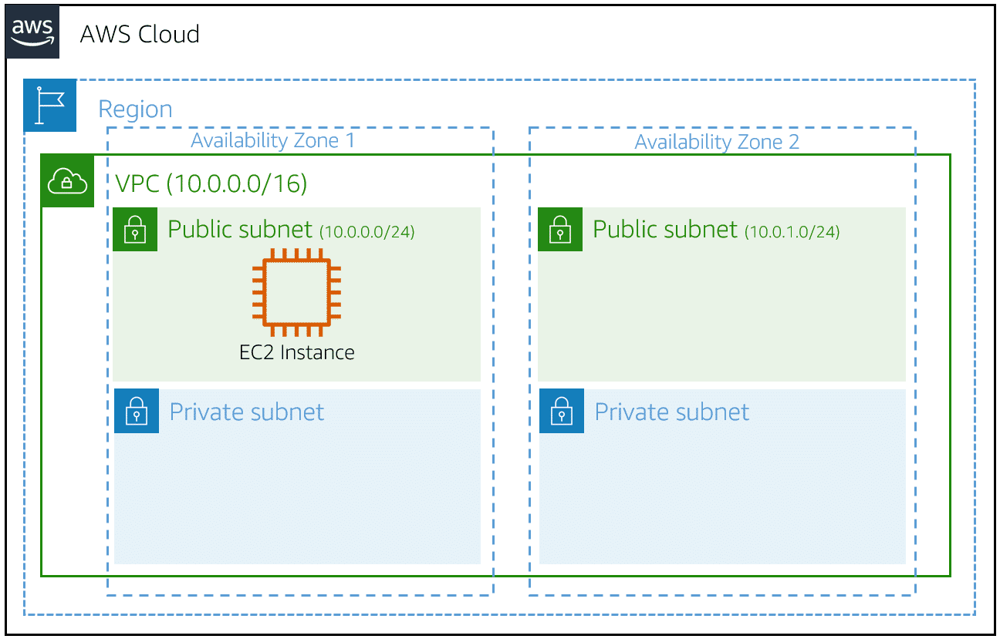
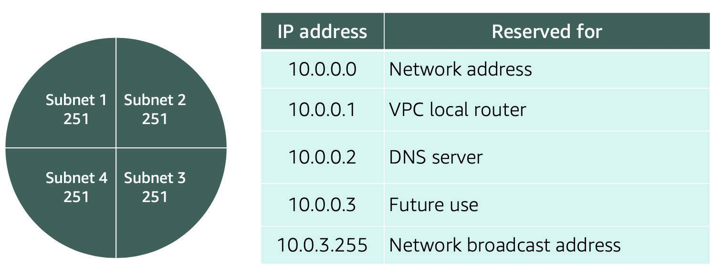

# Amazon Virtual Private Cloud

A **virtual private cloud (VPC)** is an isolated network that you create in the AWS Cloud, similar to a traditional network in a data center. When you create a VPC, you must choose three main factors:
* Name of the VPC
* Region where the VPC will live. Each VPC spans multiple Availability Zones within the selected Region
* IP range for the VPC in CIDR notation. This determines the size of your network. Each VPC can have up to four /16  IP ranges

Using this information, AWS will provision a network and IP addresses for that network

> 

## Create a subnet
After you create your VPC, you must create subnets inside the network. Think of subnets as smaller networks inside your base network – or **virtual local area networks (VLANs)** in a traditional, on-premises network. In an **on-premises network**, the typical use case for subnets is to isolate or optimize network traffic. In AWS, subnets are used to provide high availability and connectivity options for your resources.

When you create a subnet, you must specify the following:
* VPC you want your subnet to live in. In this case: VPC (10.0.0.0/16)
* Availability Zone you want your subnet to live in. In this case: AZ1
* CIDR block for your subnet, which must be a subset of the VPC CIDR block. In this case: 10.0.0.0/24

When you launch an EC2 instance, you launch it inside a subnet, which will be located inside the Availability Zone you choose.

> 

## High availability with a VPC
When you create your subnets, keep high availability in mind. To maintain redundancy and fault tolerance, create at least two subnets configured in two Availability Zones.

As you learned earlier, remember that “everything fails all of the time.” With the example network, if one of the AZs fails, you will still have your resources available in another AZ as backup.

## Reserved IPs
For AWS to configure your VPC appropriately, AWS reserves five IP addresses in each subnet. These IP addresses are used for routing, Domain Name System (DNS), and network management.

For example, consider a VPC with the IP range 10.0.0.0/22. The VPC includes 1,024 total IP addresses. This is divided into four equal-sized subnets, each with a /24 IP range with 256 IP addresses. Out of each of those IP ranges, there are only 251 IP addresses that can be used because AWS reserves five.

The five reserved IP addresses can impact how you design your network. A common starting place for those who are new to the cloud is to create a VPC with an IP range of /16 and create subnets with an IP range of /24. This provides a large amount of IP addresses to work with at both the VPC and subnet levels.

## Gateways
### Internet gateway
To enable internet connectivity for your VPC, you must create an internet gateway. Think of the gateway as similar to a modem. Just as a modem connects your computer to the internet, the internet gateway connects your VPC to the internet. Unlike your modem at home, which sometimes goes down or offline, an internet gateway is highly available and scalable. After you create an internet gateway, you attach it to your VPC.

### Virtual private gateway
A virtual private gateway connects your AWS VPC to another private network. Once you create and attach a virtual private gateway to a VPC, the gateway acts as anchor on the AWS side of the connection. On the other side of the connection, you will need to connect a customer gateway to the other private network. A customer gateway device is a physical device or software application on your side of the connection. Once you have both gateways, you can then establish an encrypted VPN connection between the two sides.

## Resources
* [VPC with Public and Private Subnets (NAT)](https://docs.aws.amazon.com/vpc/latest/userguide/VPC_Scenario2.html)
* [Custom Route Tables](https://docs.aws.amazon.com/vpc/latest/userguide/VPC_Route_Tables.html#CustomRouteTables)
* [Customer Gateway](https://docs.aws.amazon.com/vpn/latest/s2svpn/how_it_works.html#CustomerGateway)
* [What Is Amazon VPC?](https://docs.aws.amazon.com/vpc/latest/userguide/what-is-amazon-vpc.html)
* [VPCs and Subnets](https://docs.aws.amazon.com/vpc/latest/userguide/VPC_Subnets.html)