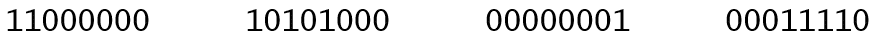
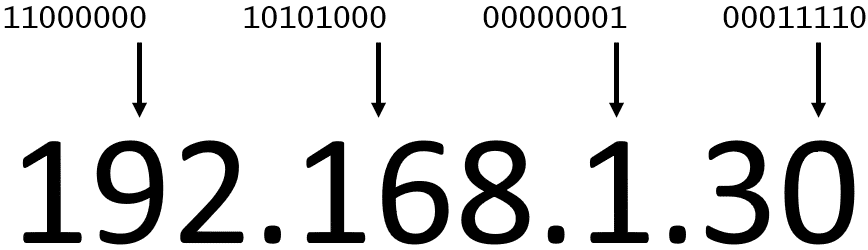
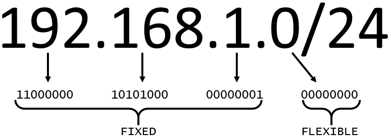

# Networking Basics

One way to think about networking is to think about sending a letter. When you send a letter, you provide the following three elements:
* The payload, or letter, inside the envelope
* The address of the sender in the From selection
* The address of the recipient in the To section

Each address must contain specific information such as:
* Name of sender and recipient
* Street
* City
* State or province
* Zip, area, or postal code
* Country

You need all parts of an address to ensure that your letter gets to its destination. Without the correct address, postal workers cannot properly deliver the letter. In the digital world, computers handle the delivery of messages in a similar way. This is called *routing*.

## IP addresses
To properly route your messages to a location, you need an address. Just like each home has a mailing address, each computer has an IP address. However, instead of using the combination of street, city, state, zip code, and country, the *IP address uses a combination of bits, 0s and 1s*.

Example of 32-bit address in binary format:

### IPv4 notation
Typically, you don’t see an IP address in its binary format. Instead, it’s converted into decimal format and noted as an Ipv4 address.

In the following diagram, the 32 bits are grouped into groups of 8 bits, also called octets. Each of these groups is converted into decimal format separated by a period.

In the end, this is what is called an Ipv4 address. This is important to know when trying to communicate to a single computer. But remember, you’re working with a network. This is where CIDR notation comes in.

## CIDR notation
192.168.1.30 is a single IP address. If you want to express IP addresses between the range of 192.168.1.0 and 192.168.1.255, how can you do that?

One way is to use **Classless Inter-Domain Routing (CIDR) notation**. CIDR notation is a compressed way of specifying a range of IP addresses. Specifying a range determines how many IP addresses are available to you.

It begins with a starting IP address and is separated by a forward slash (the “/” character) followed by a number. The number at the end specifies how many of the bits of the IP address are fixed. In this example, the first 24 bits of the IP address are fixed. The rest are flexible.

32 total bits subtracted by 24 fixed bits leaves 8 flexible bits. Each of these flexible bits can be either 0 or 1, because they are binary. That means that you have two choices for each of the 8 bits, providing 256 IP addresses in that IP range.

The higher the number after the /, the smaller the number of IP addresses in your network. For example, a range of 192.168.1.0/24 is smaller than 192.168.1.0/16.

When working with networks in the AWS Cloud, you choose your network size by using CIDR notation. In AWS, the smallest IP range you can have is /28, which provides 16 IP addresses. The largest IP range you can have is a /16, which provides 65,536 IP addresses.

## Resources
* [Stanford: Introduction to Computer Networking](https://web.stanford.edu/class/cs101/network-1-introduction.html)
* [Wikipedia: Classless Inter-Domain Routing](https://en.wikipedia.org/wiki/Classless_Inter-Domain_Routing)
* [CIDR.xyz](https://cidr.xyz/)