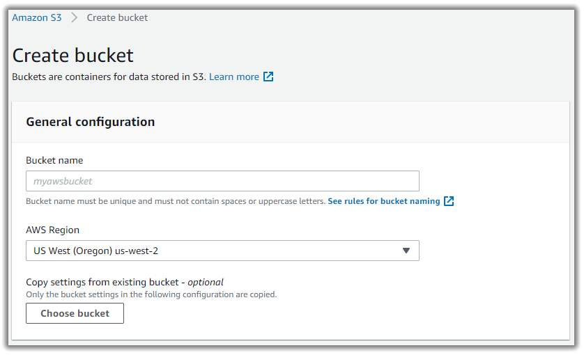

# Object Storage with Amazon Simple Storage Service

## Amazon S3
Unlike Amazon Elastic Block Store (Amazon EBS), Amazon Simple Storage Service (Amazon S3) is a standalone storage solution that isn’t tied to compute. It enables you to retrieve your data from anywhere on the web. If you have used an online storage service to back up the data from your local machine, then you most likely have used a service similar to Amazon S3. The big difference between those online storage services and Amazon S3 is the storage type.

Amazon S3 is an object storage service. Object storage stores data in a flat structure, using unique identifiers to look up objects when requested. An object is  a file combined with metadata. You can store as many of these objects as you’d like. All of the characteristics of object storage are also characteristics of Amazon S3.

### Amazon S3 Concepts
In Amazon S3, you store your objects in containers called buckets. You can’t upload any object, not even a single photo, to Amazon S3 without creating a bucket first. When you create a bucket, you specify, at the very minimum, two details – the AWS Region you want the bucket to reside in and the bucket name.



To choose a Region, you will typically select a Region that you have used for other resources, such as your compute. When you choose a Region for your bucket, all objects you put inside the bucket will be redundantly stored across multiple devices, across multiple Availability Zones. This level of redundancy is designed to provide Amazon S3 customers with 99.999999999% durability and 99.99% availability for objects over a given year.

When you choose a bucket name, it must be unique across all AWS accounts. AWS stops you from choosing a bucket name that has already been chosen by someone else in another AWS account. Once you choose a name, that name is yours and cannot be claimed by anyone else unless you delete the bucket, which then releases the name for others to use.

AWS uses the bucket name as part of the object identifier. In S3, each object is identified using a URL, as shown.


After the **http://**, you can see the bucket name. In this example, the bucket is named doc. Then, the identifier uses the **s3** service name and the service provider, **amazonaws**. After that, you have an implied folder inside the bucket called **2006-03-01** and the object inside the folder that is named **AmazonS3.html**. The object name is often referred to as the key name.

You can have folders inside of buckets to help you organize objects. However, remember that no actual file hierarchy supports this on the backend. It is instead a flat structure where all files and folders live at the same level. Using buckets and folders implies a hierarchy, which creates an understandable organization for users.

### Amazon S3 use cases
Amazon S3 is a widely used storage service, with far more use cases than could fit on one screen. The following list summarizes some of the most common ways you can use Amazon S3:

* **Backup and storage**: Amazon S3 is a natural place to back up files because it is highly redundant. As mentioned in the last unit, AWS stores your EBS snapshots in S3 to take advantage of its high availability.
* **Media hosting**: Because you can store unlimited objects, and each individual object can be up to 5 TBs, Amazon S3 is an ideal location to host video, photo, and music uploads.
* **Software delivery**: You can use Amazon S3 to host your software applications that customers can download.
* **Data lakes**: Amazon S3 is an optimal foundation for a data lake because of its virtually unlimited scalability. You can increase storage from gigabytes to petabytes of content, paying only for what you use.
* **Static websites**: You can configure your S3 bucket to host a static website of HTML, CSS, and client-side scripts.
* **Static content**: Because of the limitless scaling, the support for large files, and the fact that you access any object over the web at any time, Amazon S3 is the perfect place to store static content.

### Choose the right connectivity option for resources
Everything in Amazon S3 is private by default. This means that all S3 resources, such as buckets, folders, and objects can only be viewed by the user or AWS account that created that resource. Amazon S3 resources are all private and protected to begin with.

If you decide that you want everyone on the internet to see your photos, you can choose to make your buckets, folders, and objects public. A public resource means that everyone on the internet can see it. Most of the time, you don’t want your permissions to be all or nothing. Typically, you want to be more granular about the way you provide access to your resources.


To be more specific about who can do what with your Amazon S3 resources, Amazon S3 provides two main access management features – IAM policies and S3 bucket policies.

### IAM Policies
Previously, you learned about creating and using IAM policies. Now, you can apply that knowledge to Amazon S3. When IAM policies are attached to IAM users, groups, and roles, the policies define which actions they can perform. IAM policies are not tied to any one AWS service and can be used to define access to nearly any AWS action. 

You should use IAM policies for private buckets in the following two scenarios:
* You have many buckets with different permission requirements. Instead of defining many different S3 bucket policies, you can use IAM policies.
* You want all policies to be in a centralized location. Using IAM policies allows you to manage all policy information in one location.

### S3 Bucket Policies
Like IAM policies, Amazon S3 bucket policies are defined in a JSON format. The difference is IAM policies are attached to users, groups, and roles, whereas S3 bucket policies are only attached to S3 buckets. S3 bucket policies specify what actions are allowed or denied on the bucket.

For example, if you have a bucket called employeebucket, you can attach an S3 bucket policy to it that allows another AWS account to put objects in that bucket.

Or if you wanted to allow anonymous viewers to read the objects in employeebucket, then you can apply a policy to that bucket that allows anyone to read objects in the bucket using "Effect":Allow on the `"Action:["s3:GetObject"]"`.

Here’s an example of what the S3 bucket policy might look like.

```JSON
{
  "Version":"2012-10-17",
  "Statement": [{
    "Sid":"PublicRead",
    "Effect":"Allow",
    "Principal": "*",
    "Action":["s3:GetObject"],
    "Resource":["arn:aws:s3:::employeebucket/*"]
  }]
}
```

S3 bucket policies can only be placed on buckets, and cannot be used for folders or objects. However, the policy that is placed on the bucket applies to every object in that bucket.

You should use S3 bucket policies in the following scenarios:
* You need a simple way to do cross-account access to S3, without using IAM roles.
* Your IAM policies bump up against the defined size limit. S3 bucket policies have a larger size limit.

### Amazon S3 Encryption
Amazon S3 reinforces encryption in transit (as it travels to and from Amazon S3) and at rest. To protect data at rest, you can use encryption, as follows:

* **Server-side encryption**: This allows Amazon S3 to encrypt your object before saving it on disks in its data centers and then decrypt it when you download the objects.
* **Client-side encryption**: You can encrypt your data client-side and then upload the encrypted data to Amazon S3. In this case, you manage the encryption process, the encryption keys, and all related tools.

To encrypt in transit, you can use client-side encryption or Secure Sockets Layer (SSL).

### Amazon S3 Versioning
As described earlier, Amazon S3 identifies objects in part by using the object name. For example, when you upload an employee photo to Amazon S3, you might name the object employee.jpg and store it in a folder called employees. If you don’t use Amazon S3 versioning, every time you upload an object called employee.jpg to the employees folder, it will overwrite the original file.
This can be an issue for several reasons, including the following:

* The employee.jpg file name is a common name for an employee photo object. You or someone else who has access to the bucket might not have intended to overwrite it, but once it's overwritten, the original file can't be accessed.
* You might want to preserve different versions of employee.jpg. Without versioning, if you wanted to create a new version of employee.jpg, you would need to upload the object and choose a different name for it. Having several objects all with slight differences in naming variations can cause confusion and clutter in S3 buckets.

To counteract these issues, you can use S3 versioning. Versioning keeps multiple versions of a single object in the same bucket. This preserves old versions of an object without using different names, which helps with file recovery from accidental deletions, accidental overwrites, or  application failures.


If you enable versioning for a bucket, Amazon S3 automatically generates a unique version ID for the object. In one bucket, for example, you can have two objects with the same key, but different version IDs, such as employeephoto.gif (version 111111) and employeephoto.gif (version 121212).

Versioning-enabled buckets let you recover objects from accidental deletion or overwrite.

* Deleting an object does not remove the object permanently. Instead, Amazon S3 puts a marker on the object that shows you tried to delete it. If you want to restore the object, you can remove the marker, and it reinstates the object.
* If you overwrite an object, it results in a new object version in the bucket. You still have access to previous versions of the object.

### Versioning States
Buckets can be in one of the following three states:

* **Unversioned (default)**: No new and existing objects in the bucket have a version.
* **Versioning-enabled**: Versioning is enabled for all objects in the bucket.
* **Versioning-suspended**: Versioning is suspended for new objects. All new objects in the bucket will not have a version. However, all existing objects keep their object versions.

The versioning state applies to all objects in the bucket. Storage costs are incurred for all objects in your bucket, including all versions. To reduce your Amazon S3 bill, you might want to delete previous versions of your objects once they are no longer needed.