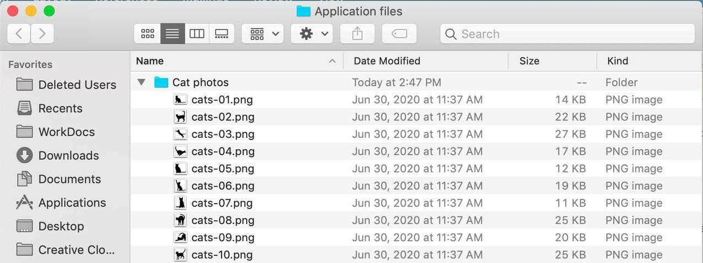
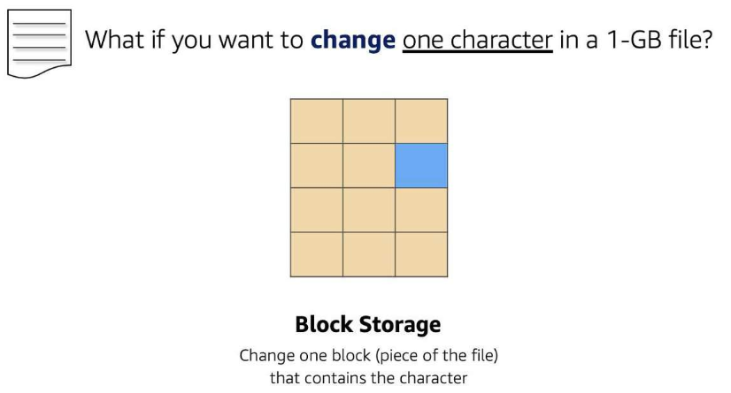
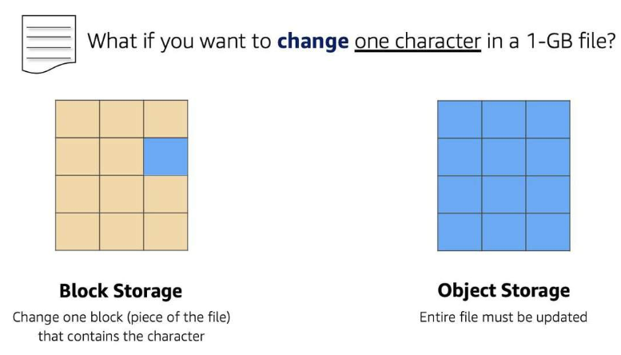

# Storage Types

AWS storage services are grouped into three categories – block storage, file storage, and object storage.

## File Storage
You might be familiar with file storage if you have interacted with file storage systems like Windows File Explorer or Finder on macOS. Files are organized in a tree-like hierarchy that consists of folders and subfolders. For example, if you have hundreds of cat photos on your laptop, you might want to create a folder called Cat photos, and place the images inside that folder to organize them. Since you know these images will be used in an application, you might want to place the Cat photos folder inside another folder called Application files.

Each file has metadata such as file name, file size, and the date the file was created. The file also has a path, for example, computer/Application_files/Cat_photos/cats-03.png. When you need to retrieve a file, your system can use the path to find it in the file hierarchy.

File storage is ideal when you require centralized access to files that need to be easily shared and managed by multiple host computers. Typically, this storage is mounted onto multiple hosts, and requires file locking and integration with existing file system communication protocols.

Common use cases for file storage include:
* Large content repositories
* Development environments
* User home directories

## Block Storage
While file storage treats files as a singular unit, block storage splits files into fixed-size chunks of data called blocks that have their own addresses. Since each block is addressable, blocks can be retrieved efficiently.

When data is requested, the addresses are used by the storage system to organize the blocks in the correct order to form a complete file to present back to the requestor. Outside of the address, no additional metadata is associated with each block. So, when you want to change a character in a file, you just change the block, or the piece of the file, that contains the character. This ease of access is why block storage solutions are fast and use less bandwidth.

Since block storage is optimized for low-latency operations, it is a typical storage choice for high-performance enterprise workloads, such as databases or enterprise resource planning (ERP) systems, that require low-latency storage.

## Object Storage
Objects, much like files, are treated as a single unit of data when stored. However, unlike file storage, these objects are stored in a flat structure instead of a hierarchy. Each object is a file with a unique identifier. This identifier, along with any additional metadata, is bundled with the data and stored.

Changing just one character in an object is more difficult than with block storage. When you want to change one character in a file, the entire file must be updated.

With object storage, you can store almost any type of data, and there is no limit to the number of objects stored, which makes it readily scalable. Object storage is generally useful when storing large datasets; unstructured files, like media assets; and static assets, like photos.

## Relate back to traditional  storage systems
If you have worked with on-premises storage, you might already be familiar with block, file, and object storage. Consider the following technologies and how they relate to systems you might have seen before:

* Block storage in the cloud is analogous to *direct-attached storage (DAS)* or a *storage area network (SAN)*.
* File storage systems are often supported with a *network attached storage (NAS) server*.

Adding storage in a traditional data center is a rigid process – the storage solutions must be purchased, installed, and configured. With cloud computing, the process is more flexible. You can create, delete, and modify storage solutions within a matter of minutes.

## Resources
* [What Is Cloud Storage](https://aws.amazon.com/what-is-cloud-storage/)
* [Types of Cloud Storage](https://aws.amazon.com/what-is-cloud-object-storage/#types)