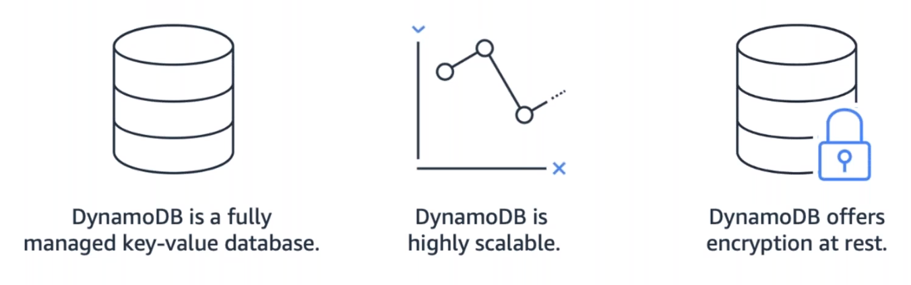
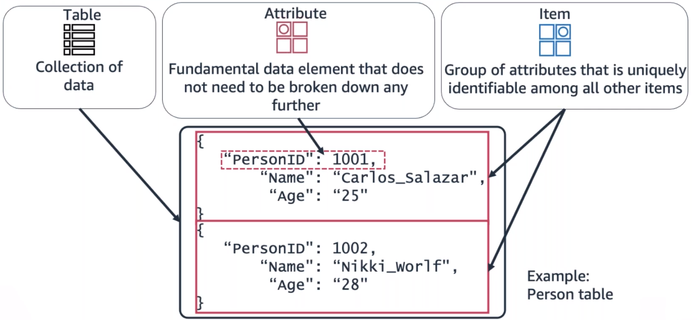

# Amazon DynamoDB

**Amazon DynamoDB** is a fully managed NoSQL database service that provides fast and predictable performance with seamless scalability. DynamoDB lets you offload the administrative burdens of operating and scaling a distributed database so that you don't have to worry about hardware provisioning, setup and configuration, replication, software patching, or cluster scaling.

With DynamoDB, you can create database tables that can store and retrieve any amount of data and serve any level of request traffic. You can scale up or scale down your tables' throughput capacity without downtime or performance degradation. You can use the AWS Management Console to monitor resource usage and performance metrics.

DynamoDB automatically spreads the data and traffic for your tables over a sufficient number of servers to handle your throughput and storage requirements, while maintaining consistent and fast performance. All of your data is stored on *solid-state disks (SSDs)* and is automatically replicated across multiple Availability Zones in an AWS Region, providing built-in high availability and data durability.

> 
>
> Benefits of Amazon DynamoDB

## Amazon DynamoDB core components
In DynamoDB, tables, items, and attributes are the core components that you work with. A **table** is a collection of items, and each item is a collection of attributes. DynamoDB uses *primary keys* to uniquely identify each item in a table and secondary indexes to provide more querying flexibility.

The following are the basic DynamoDB components:

* **Tables** – Similar to other database systems, DynamoDB stores data in tables. A *table* is a collection of data. For instance, you could have a table called People that you could use to store personal contact information about friends, family, or anyone else of interest. You could also have a Cars table to store information about vehicles that people drive.
* **Items** – Each table contains zero or more items. An *item* is a group of attributes that is uniquely identifiable among all the other items. In a People table, each item represents a person. In a Cars table, each item represents one vehicle. Items in DynamoDB are similar in many ways to rows, records, or tuples in other database systems. In DynamoDB, there is no limit to the number of items you can store in a table.
* **Attributes** – Each item is composed of one or more attributes. An attribute is a fundamental data element, something that does not need to be broken down any further. For example, an item in a People table might contain attributes called PersonID, LastName, FirstName, and so on. In a Department table, an item might have attributes such as DepartmentID, Name, Manager, and so on. Attributes in DynamoDB are similar in many ways to fields or columns in other database systems.

> 

## Amazon DynamoDB security
DynamoDB also offers encryption at rest, which eliminates the operational burden and complexity involved in protecting sensitive data. For more information, see [DynamoDB Encryption at Rest](https://docs.aws.amazon.com/amazondynamodb/latest/developerguide/EncryptionAtRest.html).

## Resources
* [Introduction to Amazon DynamoDB](https://docs.aws.amazon.com/amazondynamodb/latest/developerguide/Introduction.html)