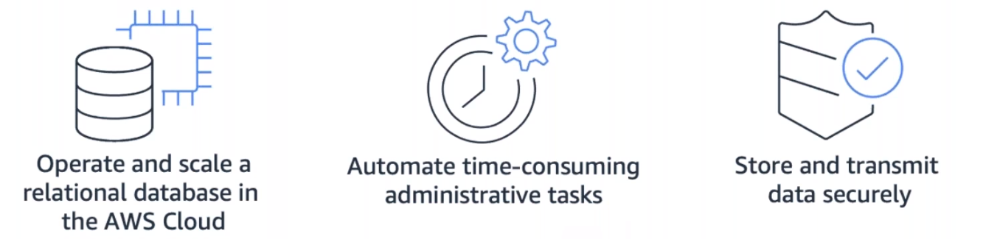
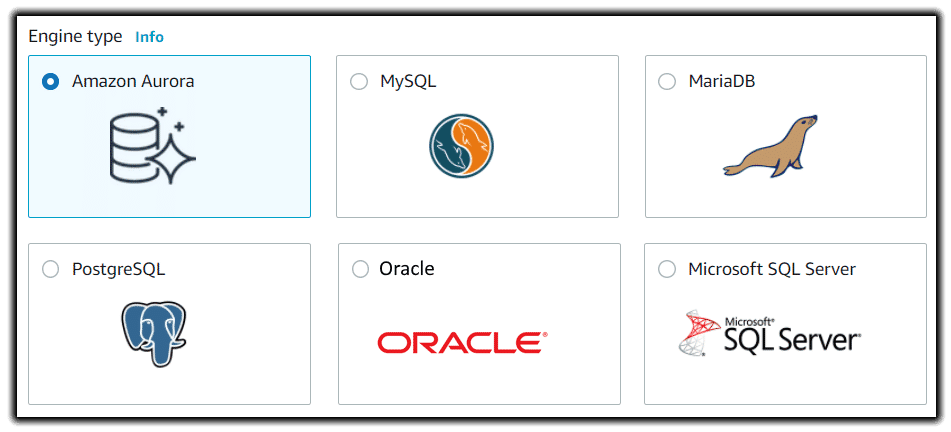
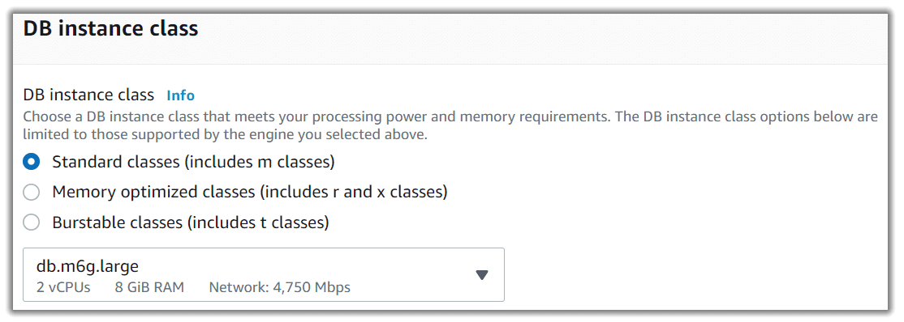
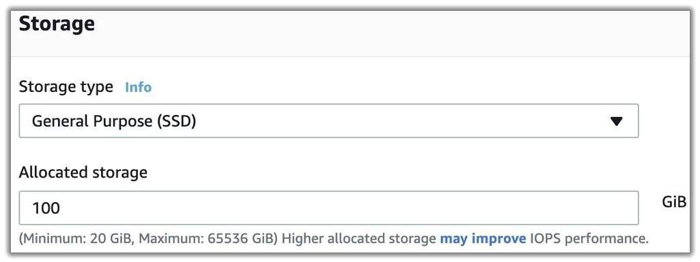
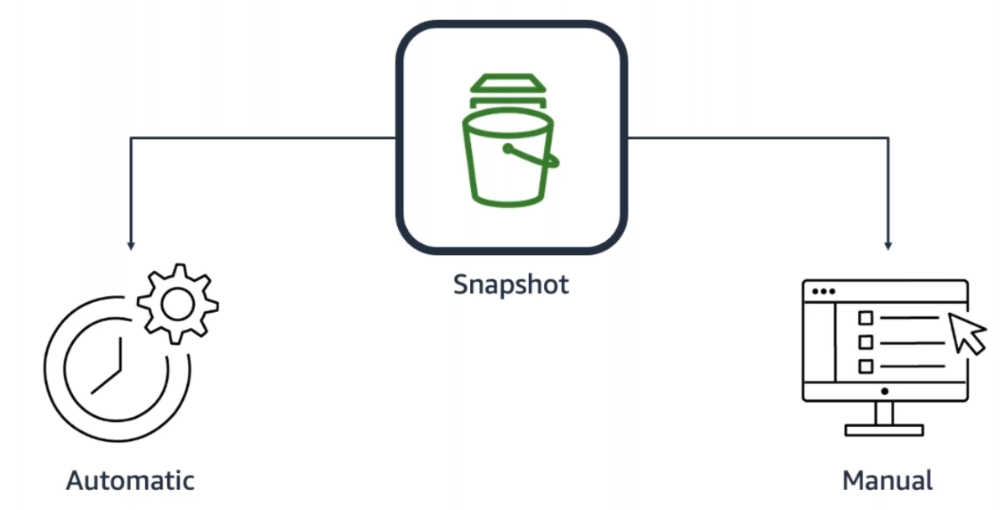
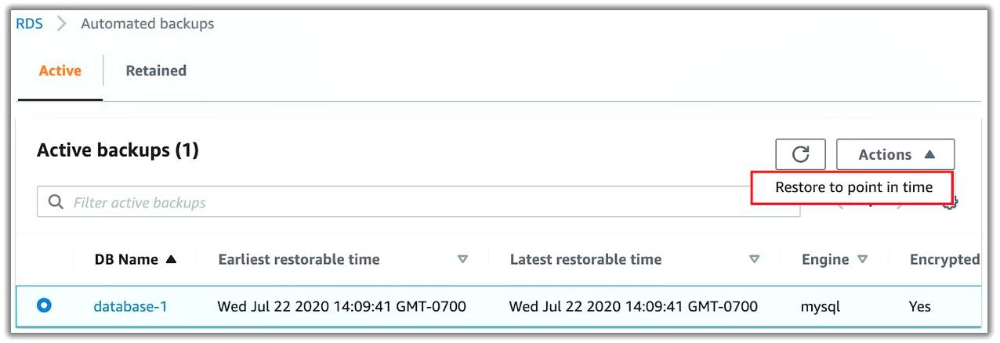
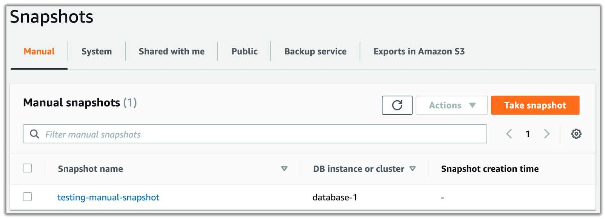

# Amazon Relational Database Service

> 

*Amazon Relational Database Service (Amazon RDS)* lets customers create and manage relational databases in the cloud without the operational burden of traditional database management. For example, if you sell healthcare equipment and your goal is to be the number-one seller in the Pacific Northwest, building a database doesn’t directly help you achieve that goal, although having a database is necessary to achieve the goal.

Amazon RDS offloads some of the unrelated work of creating and managing a database. You can focus on the tasks that differentiate your application, instead of focusing on infrastructure-related tasks, like provisioning, patching, scaling, and restoring.

Amazon RDS supports most of the popular relational database management systems, ranging from commercial options, open source options, and even an AWS-specific option. The supported Amazon RDS engines are:

* **Commercial**: Oracle, Microsoft SQL Server (MSSQL)
* **Open Source**: MySQL, PostgreSQL, MariaDB
* **Cloud Native**: Amazon Aurora

> 

The cloud native option, Amazon Aurora, is a MySQL- and PostgreSQL-compatible database built for the cloud. It is more durable, more available, and provides faster performance than the Amazon RDS version of MySQL and PostgreSQL. To learn more about Amazon Aurora, view the Amazon Aurora FAQs.

## DB Instances
Just like the databases that you build and manage yourself, Amazon RDS is built off of compute and storage. The compute portion is called the DB (database) instance, which runs the database engine. Depending on the engine of the DB instance you choose, the engine will have different supported features and configurations. A DB instance can contain multiple databases with the same engine, and each database can contain multiple tables.

Underneath the DB instance is an EC2 instance. However, this instance is managed through the Amazon RDS console instead of the Amazon EC2 console. When you create your DB instance, you choose the instance type and size. Amazon RDS supports the following three instance families:

* **Standard**, which includes general-purpose instances
* **Memory Optimized**, which is optimized for memory-intensive applications
* **Burstable Performance**, which provides a baseline performance level, with the ability to burst to full CPU usage

The DB instance you choose affects how much processing power and memory it has. The available options depend on the selected engine. You can find more information about DB instance types in the Resources section.

Much like a regular EC2 instance, a DB instance uses Amazon Elastic Block Store (EBS) volumes as its storage layer. You can choose from the following Amazon EBS volume storage types:

* General purpose (SSD)
* Provisioned IOPS (SSD)
* Magnetic storage (not recommended)

## Amazon RDS in an Amazon Virtual Private Cloud
When you create a DB instance, you select the Amazon Virtual Private Cloud (VPC) that your databases will live in. Then, you select the subnets that you want the DB instances to be placed in. This is referred to as a DB subnet group. To create a DB subnet group, you specify the following:
* *Availability Zones (AZs)* that include the subnets you want to add
* *Subnets* in the AZ where your DB instances are placed

The subnets you add should be private, so they don’t have a route to the internet gateway. This ensures that your DB instance, and the data inside of it, can only be reached by the app backend.

Access to the DB instance can be further restricted by using network access control lists (network ACLs) and security groups. With these firewalls, you can control, at a granular level, the type of traffic you want to allow into your database.

Using these controls provide layers of security for your infrastructure. It reinforces that only the backend instances have access to the database.

## Secure Amazon RDS with AWS Identity and Access Management (IAM)
Network ACLs and security groups help users dictate the flow of traffic. If you want to restrict the actions and resources others can access, you can use IAM policies.

### Backup data

> 

You don’t want to lose you data. To take regular backups of your RDS instance, you can use:

* Automatic backups
* Manual snapshots

#### Automatic backups
Automated backups are turned on by default. This backs up your entire DB instance (not just individual databases on the instance) and your transaction logs. When you create your DB instance, you set a backup window that is the period of time that automatic backups occur. Typically, you want to set the windows during a time when your database experiences little activity, because it can cause increased latency and downtime.

You can retain your automated backups between 0 and 35 days. You might ask yourself, “Why set automated backups for 0 days?” The 0 days setting actually disables automatic backups from happening. If you set it to 0, it will also delete all existing automated backups. This is not ideal. The benefit of having automated backups is to have the ability to do point-in-time recovery.

*Point-in-time recovery* creates a new DB instance using data restored from a specific point in time. This restoration method provides more granularity by restoring the full backup and rolling back transactions up to the specified time range.

#### Manual snapshots
If you want to keep your automated backups longer than 35 days, use manual snapshots. Manual snapshots are similar to taking Amazon EBS snapshots, except that you manage them in the Amazon RDS console. These are backups that you can initiate at any time. They exist until you delete them. For example, to meet a compliance requirement that mandates you to keep database backups for a year, you would need to use manual snapshots. If you restore data from a manual snapshot, it creates a new DB instance using the data from the snapshot.

## Backup options
It is advisable to deploy both options. Automated backups are beneficial for point-in-time recovery. Manual snapshots allow you to retain backups for longer than 35 days. 

## Redundancy with Amazon RDS Multi-AZ
When you enable Amazon RDS Multi-AZ, Amazon RDS creates a redundant copy of your database in another AZ. You end up with two copies of your database – a primary copy in a subnet in one AZ and a standby copy in a subnet in a second AZ.

The primary copy of your database provides access to your data so that applications can query and display the information. The data in the primary copy is synchronously replicated to the standby copy. The standby copy is not considered an active database, and it does not get queried by applications.

To improve availability, Amazon RDS Multi-AZ ensures that you have two copies of your database running and that one of them is in the primary role. If an availability issue arises, such as the primary database loses connectivity, Amazon RDS triggers an automatic failover.

When you create a DB instance, a *Domain Name System (DNS)* name is provided. AWS uses that DNS name to failover to the standby database. In an automatic failover, the standby database is promoted to the primary role, and queries are redirected to the new primary database.

To ensure that you don’t lose Multi-AZ configuration, a new standby database is created by either:
* Demoting the previous primary to standby if it’s still up and running
* Standing up a new standby DB instance

The reason you can select multiple subnets for an Amazon RDS database is because of the Multi-AZ configuration. You’ll want to ensure that you have used subnets in different AZs for your primary and standby copies.

## Resources
* [Working with Backups](https://docs.aws.amazon.com/AmazonRDS/latest/UserGuide/USER_WorkingWithAutomatedBackups.html)
* [Amazon RDS Backup and Restore](https://aws.amazon.com/rds/details/backup/)
* [Creating and Using an IAM Policy for IAM Database Access](https://docs.aws.amazon.com/AmazonRDS/latest/UserGuide/UsingWithRDS.IAMDBAuth.IAMPolicy.html)
* [Amazon Virtual Private Cloud VPCs and Amazon RDS](https://docs.aws.amazon.com/AmazonRDS/latest/UserGuide/USER_VPC.html)