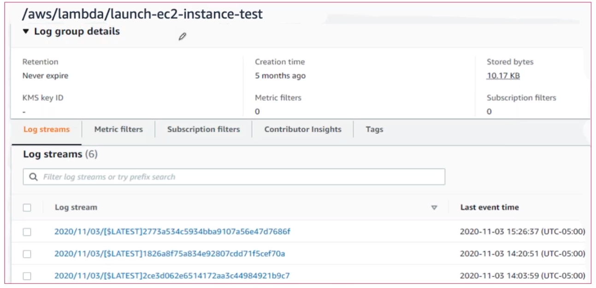
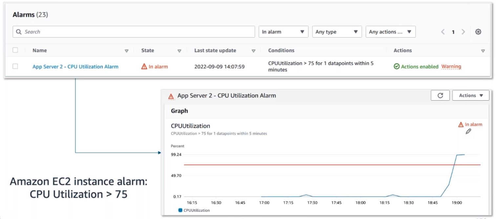

# Amazon CloudWatch

> 

### How CloudWatch works
With CloudWatch, all you need to get started is an AWS account. It is a managed service that you can use for monitoring, without managing the underlying infrastructure. Monitoring the individual services independently could be challenging. CloudWatch acts as a centralized place where metrics are gathered and analyzed. You already learned how EC2 instances post CPU utilization as a metric to CloudWatch. Different AWS resources post different metrics that you can monitor. You can view a list of services that send metrics to CloudWatch in the Resources section.

Many AWS services send metrics automatically for free to CloudWatch at a rate of one data point per metric per 5-minute interval. This gives you visibility into your systems without any extra cost. This is known as basic monitoring. For many applications, basic monitoring is adequate.

For applications running on EC2 instances, you can get more granularity by posting metrics every minute instead of every 5 minutes using a feature like detailed monitoring. Detailed monitoring incurs a fee.

## CloudWatch Metrics

> 
>
> Example: Amazon EC2 instance metrics

Each metric in CloudWatch has a timestamp and is organized into containers called ***namespaces***. Metrics in different namespaces are isolated from each other – you can think of them as belonging to different categories.

AWS services that send data to CloudWatch attach dimensions to each metric. A dimension is a name/value pair that is part of the metric’s identity. You can use dimensions to filter the results that CloudWatch returns. For example, you can get statistics for a specific EC2 instance by specifying the InstanceId dimension when you search.

## Custom Metrics
Suppose you have an application and you want to record the number of page views your website gets. How would you record this metric with CloudWatch? First, it's an application-level metric. That means it’s not something the EC2 instance would post to CloudWatch by default. This is where custom metrics come in. Custom metrics allows you to publish your own metrics to CloudWatch.

If you want to gain more granular visibility, you can use high-resolution custom metrics, which enable you to collect custom metrics down to a 1-second resolution. This means that you can send one data point per second per custom metric.

Following are some other examples of custom metrics:
* Web page load times
* Request error rates
* Number of processes or threads on your instance
* Amount of work performed by your application

You can get started with custom metrics by programmatically sending the metric to CloudWatch using the PutMetricData API.

## CloudWatch Dashboards
Once you’ve provisioned your AWS resources and they are sending metrics to CloudWatch, you can then visualize and review that data using the CloudWatch console with dashboards. Dashboards are customizable home pages that you use for data visualization for one or more metrics through the use of widgets, such as a graph or text.

You can build many custom dashboards, each one focusing on a distinct view of your environment. You can even pull data from different Regions into a single dashboard in order to create a global view of your architecture.

CloudWatch aggregates statistics according to the period of time that you specify when creating your graph or requesting your metrics. You can also choose whether your metric widgets display live data. Live data is data published within the last minute that has not been fully aggregated.

CloudWatch aggregates statistics according to the period of time that you specify when creating your graph or requesting your metrics. You can also choose whether your metric widgets display live data. Live data is data published within the last minute that has not been fully aggregated.

You are not bound to using CloudWatch exclusively for all your visualization needs. You can use external or custom tools to ingest and analyze CloudWatch metrics using the GetMetricData API.

As far as security goes, you can control who has access to view or manage your CloudWatch dashboards through AWS Identity and Access Management (IAM) policies that get associated with IAM users, IAM groups, or IAM roles.

## Amazon CloudWatch Logs

> 
>
> Example: AWS Service logs

CloudWatch can also be the centralized place for logs to be stored and analyzed, using Amazon CloudWatch Logs. CloudWatch Logs can monitor, store, and access your log files from applications running on Amazon EC2 instances, AWS Lambda functions, and other sources.

CloudWatch Logs allows you to query and filter your log data. For example, suppose you’re looking into an application logic error for your application, and you know that when this error occurs it will log the stack trace. Since you know it logs the error, you query your logs in CloudWatch Logs to find the stack trace. You also set up metric filters on logs, which turn log data into numerical CloudWatch metrics that you can graph and use on your dashboards.

Some services are set up to send log data to CloudWatch Logs with minimal effort, like AWS Lambda. With AWS Lambda, all you need to do is give the Lambda function the correct IAM permissions to post logs to CloudWatch Logs. Other services require more configuration. For example, if you want to send your application logs from an EC2 instance into CloudWatch Logs, you need to first install and configure the CloudWatch Logs agent on the EC2 instance.

The CloudWatch Logs agent enables Amazon EC2 instances to automatically send log data to CloudWatch Logs. The agent includes the following components:
* Plug-in to the AWS Command Line Interface (AWS CLI) that pushes log data to CloudWatch Logs
* Script that initiates the process to push data to CloudWatch Logs
* **`cron job`** that ensures the daemon is always running

After the agent is installed and configured, you can view your application logs in CloudWatch Logs.

## CloudWatch Logs terminology
Log data sent to CloudWatch Logs can come from different sources, so it’s important you understand how they’re organized and the terminology used to describe your logs.

**Log event**: A log event is a record of activity recorded by the application or resource being monitored, and it has a timestamp and an event message.

**Log stream**: Log events are then grouped into log streams, which are sequences of log events that all belong to the same resource being monitored. For example, logs for an EC2 instance are grouped together into a log stream that you can filter or query for insights.

**Log groups**: Log streams are then organized into log groups. A ***log group*** is composed of log streams that all share the same retention and permissions settings. For example, if you have multiple EC2 instances hosting your application and you are sending application log data to CloudWatch Logs, you can group the log streams from each instance into one log group. This helps keep your logs organized.

## CloudWatch alarms

> 
>
> Example: Amazon EC2 instance alarms: CPU Utilization > 75

You can create CloudWatch alarms to automatically initiate actions based on sustained state changes of your metrics. You configure when alarms are triggered and the action that is performed.

You first must decide which metric you want to set an alarm for, and then you define the threshold that will trigger the alarm. Next, you define the threshold's time period. For example, if you want to set up an alarm for an EC2 instance to trigger when the CPU utilization goes over a threshold of 80%, you also must specify the time period the CPU utilization is over the threshold. You don’t want to trigger an alarm based on short temporary spikes in the CPU. You only want to trigger an alarm if the CPU is elevated for a sustained amount of time. For example, if CPU utilization is over 80% for 5 minutes or longer, there might be a resource issue. Keeping all that in mind, to set up an alarm you need to choose the metric, threshold, and time period.

An alarm has three possible states.
* **OK**: The metric is within the defined threshold. Everything appears to be operating like normal.
* **ALARM**: The metric is outside the defined threshold. This could be an operational issue.
* **INSUFFICIENT_DATA**: The alarm has just started, the metric is not available, or not enough data is available for the metric to determine the alarm state.

An alarm can be triggered when it transitions from one state to another. Once an alarm is triggered, it can initiate an action. Actions can be an Amazon EC2 action, an automatic scaling action, or a notification sent to Amazon Simple Notification Service (Amazon SNS).

## Prevent and troubleshoot issues with CloudWatch alarms
CloudWatch Logs uses metric filters to turn the log data into metrics that you can graph or set an alarm on. For the Employee Directory application, suppose you set up a metric filter for 500-error response codes. Then, you define an alarm for that metric that will go into the ALARM state if 500-error responses go over a certain amount for a sustained time period. If it’s more than five 500-error responses per hour, the alarm should enter the ALARM state. Next, you define an action that you want to take place when the alarm is triggered. In this case, it makes sense to send an email or text alert to you so you can start troubleshooting the website, hopefully fixing it before it becomes a bigger issue. Once the alarm is set up, you feel comfortable knowing that if the error happens again, you’ll be notified promptly.

You can set up different alarms for different reasons to help you prevent or troubleshoot operational issues. In the scenario just described, the alarm triggers an Amazon SNS notification that goes to a person who looks into the issue manually. Another option is to have alarms trigger actions that automatically remediate technical issues.

For example, you can set up an alarm to trigger an EC2 instance to reboot, or scale services up or down. You can even set up an alarm to trigger an Amazon SNS notification that triggers an AWS Lambda function. The Lambda function then calls any AWS API to manage your resources and troubleshoot operational issues. By using AWS services together like this, you can respond to events more quickly.

## Resources
* [Getting Started with Amazon CloudWatch](https://docs.aws.amazon.com/AmazonCloudWatch/latest/monitoring/GettingStarted.html)
* [What Is Amazon CloudWatch Logs?](https://docs.aws.amazon.com/AmazonCloudWatch/latest/logs/WhatIsCloudWatchLogs.html)
* [AWS Services That Publish CloudWatch Metrics](https://docs.aws.amazon.com/AmazonCloudWatch/latest/monitoring/aws-services-cloudwatch-metrics.html)
* [View Available Metrics](https://docs.aws.amazon.com/AmazonCloudWatch/latest/monitoring/viewing_metrics_with_cloudwatch.html)
* [Amazon CloudWatch Pricing](https://aws.amazon.com/cloudwatch/pricing/)
* [Amazon Simple Notification Service](https://aws.amazon.com/sns/)
* [EC2 Auto Scaling Actions](https://aws.amazon.com/ec2/autoscaling/)