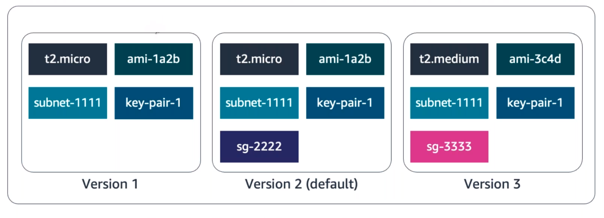
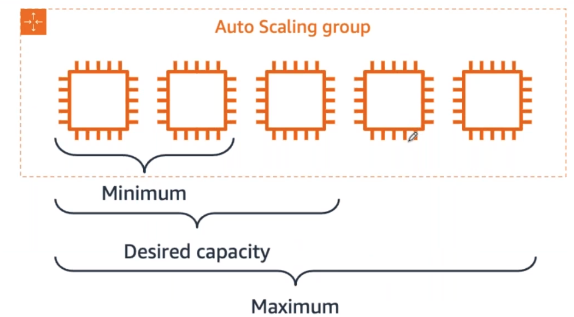

# Amazon EC2 Auto Scaling

### Capacity issues
Availability and reachability is improved by adding one more server. However, the entire system can again become unavailable if there is a capacity issue. This section looks at load issue for both types of systems discussed – active-passive and active-active.

## Vertical Scaling
If too many requests are sent to a single active-passive system, the active server will become unavailable and hopefully failover to the passive server. But this doesn’t solve anything.

With active-passive, you need vertical scaling. This means increasing the size of the server. With EC2 instances, you select either a larger type or a different instance type. This can only be done while the instance is in a stopped state.

In this scenario, the following steps occur:
1. Stop the passive instance. This doesn’t impact the application because it’s not taking any traffic.
2. Change the instance size or type, and then start the instance again.
3. Shift the traffic to the passive instance, turning it active.
4. Stop, change the size, and start the previous active instance since both instances should match.

When the number of requests reduces, the same operation must be done. Even though there aren’t that many steps involved, it’s actually a lot of manual work. Another disadvantage is that a server can only scale vertically up to a certain limit. When that limit is reached, the only option is to create another active-passive system and split the requests and functionalities across them. This could require massive application rewriting.

This is where the active-active system can help. When there are too many requests, this system can be scaled horizontally by adding more servers.

## Horizontal Scaling
As mentioned, for the application to work in an active-active system, it’s already created as stateless, not storing any client sessions on the server. This means that having two servers or having four wouldn’t require any application changes. It would only be a matter of creating more instances when required and shutting them down when traffic decreases. The Amazon EC2 Auto Scaling service can take care of that task by automatically creating and removing EC2 instances based on metrics from Amazon CloudWatch.

You can see that there are many more advantages to using an active-active system in comparison with an active-passive. Modifying your application to become stateless enables scalability.

## ELB with EC2 Auto Scaling
The ELB service integrates seamlessly with EC2 Auto Scaling. As soon as a new EC2 instance is added to or removed from the EC2 Auto Scaling group, ELB is notified. However, before it can send traffic to a new EC2 instance, it needs to validate that the application running on the EC2 instance is available.

This validation is done by way of the ELB health checks feature. Monitoring is an important part of load balancers, because they should route traffic to only healthy EC2 instances. That’s why ELB supports two types of health checks.
* Establishing a connection to a backend EC2 instance using TCP, and marking the instance as available if the connection is successful.
* Making an HTTP or HTTPS request to a webpage that you specify, and validating that an HTTP response code is returned.

## Traditional scaling versus auto scaling
With a traditional approach to scaling, you buy and provision enough servers to handle traffic at its peak. However, this means that at night time, for example, you might have more capacity than traffic, which means you’re wasting money. Turning off your servers at night or at times where the traffic is lower only saves on electricity.

The cloud works differently with a pay-as-you-go model. You must turn off the unused services, especially EC2 instances that you pay for on-demand. You could manually add and remove servers at a predicted time. But with unusual spikes in traffic, this solution leads to a waste of resources with over-provisioning or a loss of customers due to under-provisioning.

The need here is for a tool that automatically adds and removes EC2 instances according to conditions you define – that’s exactly what the EC2 Auto Scaling service does.

## Amazon EC2 Auto Scaling
The Amazon EC2 Auto Scaling service adds and removes capacity to keep a steady and predictable performance at the lowest possible cost. By adjusting the capacity to exactly what your application uses, you only pay for what your application needs. And even with applications that have steady usage, EC2 Auto Scaling can help with fleet management. If an EC2 instance has an issue, EC2 Auto Scaling can automatically replace the instance. This means that EC2 Auto Scaling helps both to scale your infrastructure and ensure high availability.

## Configure EC2 Auto Scaling components
Three main components of EC2 Auto Scaling are as follows:

* **Launch template or configuration**: What resource should be automatically scaled?
* **EC2 Auto Scaling Group**: Where should the resources be deployed?
* **Scaling policies**: When should the resources be added or removed?

## Launch templates
Multiple parameters are required to create EC2 instances – Amazon Machine Image (AMI) ID, instance type, security group, additional Amazon Elastic Block Store (EBS) volumes, and more. All this information is also required by EC2 Auto Scaling to create the EC2 instance on your behalf when there is a need to scale. This information is stored in a launch template.

You can use a launch template to manually launch an EC2 instance. You can also use it with EC2 Auto Scaling. It also supports versioning, which allows for quickly rolling back if there's an issue or a need to specify a default version. This way, while iterating on a new version, other users can continue launching EC2 instances using the default version until you make the necessary changes.

You can create a launch template in one of three ways.
* The fastest way to create a template is to use an existing EC2 instance. All the settings are already defined.
* Another option is to create one from an already existing template or a previous version of a launch template.
* The last option is to create a template from scratch. The following options will need to be defined: AMI ID, instance type, key pair, security group, storage, and resource tags.

Another way to define what Amazon EC2 Auto Scaling needs to scale is by using a launch configuration. It’s similar to the launch template, but it doesn’t allow for versioning using a previously created launch configuration as a template. Nor does it allow for creating one from an already existing EC2 instance. For these reasons and to ensure that you’re getting the latest features from Amazon EC2, AWS recommends that you use a launch template instead of a launch configuration.

## EC2 Auto Scaling groups
The next component that EC2 Auto Scaling needs is an EC2 Auto Scaling Group. An auto scaling group helps you define where EC2 Auto Scaling deploys your resources. This is where you specify the Amazon VPC and subnets the EC2 instance should be launched in. EC2 Auto Scaling takes care of creating the EC2 instances across the subnets, so select at least two subnets that are across different Availability Zones.

With Auto Scaling groups, you can specify the type of purchase for the EC2 instances. You can use On-Demand only, Spot only, or a combination of the two, which allows you to take advantage of Spot instances with minimal administrative overhead.

To specify how many instances EC2 Auto Scaling should launch, you have three capacity settings to configure for the group size.
* **Minimum**: The minimum number of instances running in your Auto Scaling group, even if the threshold for lowering the amount of instances is reached.
* **Maximum**: The maximum number of instances running in your Auto Scaling group, even if the threshold for adding new instances is reached.
* **Desired capacity**: The amount of instances that should be in your Auto Scaling group. This number can only be within or equal to the minimum or maximum. EC2 Auto Scaling automatically adds or removes instances to match the desired capacity number.

When EC2 Auto Scaling removes EC2 instances because the traffic is minimal, it keeps removing EC2 instances until it reaches a minimum capacity. Depending on your application, using a minimum of two is a good idea to ensure high availability, but you know how many EC2 instances at a bare minimum your application requires at all times. When reaching that limit, even if EC2 Auto Scaling is instructed to remove an instance, it does not, to ensure the minimum is kept.

On the other hand, when the traffic keeps growing, EC2 Auto Scaling keeps adding EC2 instances. This means the cost for your application will also keep growing. That’s why you must set a maximum amount – to make sure it doesn’t go above your budget.

The desired capacity is the amount of EC2 instances that EC2 Auto Scaling creates at the time the group is created. If that number decreases, EC2 Auto Scaling removes the oldest instance by default. If that number increases, EC2 Auto Scaling creates new instances using the launch template.

## Availability with EC2 Auto Scaling
Different numbers for minimum, maximum, and desired capacity are used for dynamically adjusting the capacity. However, if you prefer to use EC2 Auto Scaling for fleet management, you can configure the three settings to the same number, for example four, as shown in the image. EC2 Auto Scaling will ensure that if an EC2 instance becomes unhealthy, it replaces it to always ensure that four EC2 instances are available. This ensures high availability for your applications.

## Automation with scaling policies
By default, an Auto Scaling group will be kept to its initial desired capacity. While it’s possible to manually change the desired capacity, you can also use scaling policies.

In the AWS Monitoring module, you learned about Amazon CloudWatch metrics and alarms. You use metrics to keep information about different attributes of your EC2 instance, like the CPU percentage. You use alarms to specify an action when a threshold is reached. Metrics and alarms are what scaling policies use to know when to act. For example, you can set up an alarm that states when the CPU utilization is above 70% across the entire fleet of EC2 instances, trigger a scaling policy to add an EC2 instance.

Three types of scaling policies are available – simple, step, and target tracking scaling.

### Simple scaling policy
A simple scaling policy allows you to do exactly what’s described in this module. You use a CloudWatch alarm and specify what to do when it is triggered. This can be a number of EC2 instances to add or remove, or a specific number to set the desired capacity to. You can specify a percentage of the group instead of using an amount of EC2 instances, which makes the group grow or shrink more quickly.

Once the scaling policy is triggered, it waits a cooldown period before taking any other action. This is important because it takes time for the EC2 instances to start and the CloudWatch alarm might still be triggered while the EC2 instance is booting. For example, you could decide to add an EC2 instance if the CPU utilization across all instances is above 65%. You don’t want to add more instances until that new EC2 instance is accepting traffic. However, what if the CPU utilization was now above 85% across the Auto Scaling group? Adding one instance might not be the right move. Instead, you might want to add another step in your scaling policy. Unfortunately, a simple scaling policy can’t help with that.

### Step scaling policy
This is where a step scaling policy helps. Step scaling policies respond to additional alarms even while a scaling activity or health check replacement is in progress. Similar to the example above, you might decide to add two more instances when CPU utilization is at 85% and four more instances when it’s at 95%.

Deciding when to add and remove instances based on CloudWatch alarms might seem like a difficult task. This is why the third type of scaling policy exists – target tracking.

### Target tracking scaling policy
If your application scales based on average CPU utilization, average network utilization (in or out), or request count, then this scaling policy type is the one to use. All you need to provide is the target value to track and it automatically creates the required CloudWatch alarms.

## Resources
* [Amazon EC2 Auto Scaling](https://aws.amazon.com/ec2/autoscaling/)
* [Amazon EC2 Auto Scaling FAQs](https://aws.amazon.com/ec2/autoscaling/faqs/)
* [Setting Capacity Limits for Your Auto Scaling Group](https://docs.aws.amazon.com/autoscaling/ec2/userguide/asg-capacity-limits.html)
* [Step and Simple Scaling Policies for Amazon EC2 Auto Scaling](https://docs.aws.amazon.com/autoscaling/ec2/userguide/as-scaling-simple-step.html)
* [Target Tracking Scaling Policies for Amazon EC2 Auto Scaling](https://docs.aws.amazon.com/autoscaling/ec2/userguide/as-scaling-target-tracking.html)
* [Creating an Auto Scaling Group Using a Launch Template](https://docs.aws.amazon.com/autoscaling/ec2/userguide/create-asg-launch-template.html)