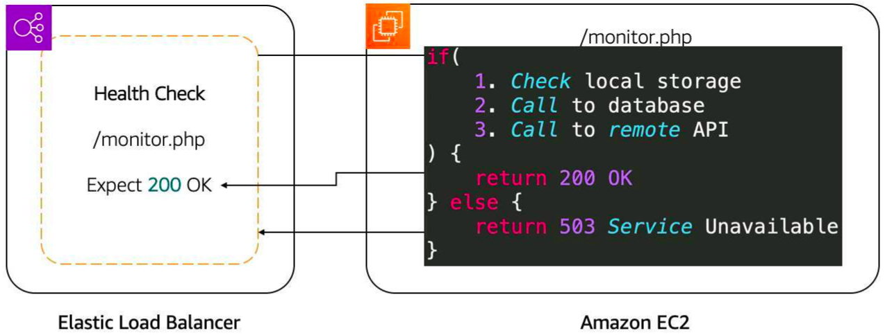
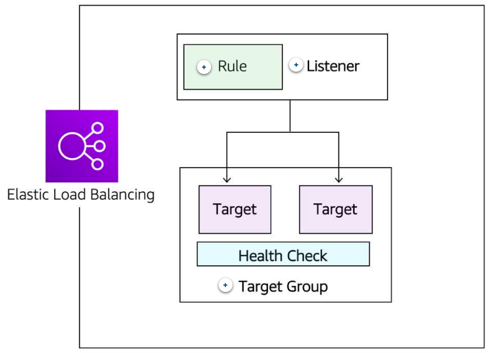

# Traffic Routing with Amazon Elastic Load Balancing

## Load Balancers
Load balancing refers to the process of distributing tasks across a set of resources. In the case of the Employee Directory application, the resources are EC2 instances that host the application, and the tasks are the requests being sent. You can use a load balancer to distribute the requests across all the servers hosting the application.

To do this, you first need to enable the load balancer to take all of the traffic and redirect it to the backend servers based on an algorithm. The most popular algorithm is round-robin, which sends the traffic to each server one after the other.

A typical request for an application starts from a client's browser. The request is sent to a load balancer. Then, it’s sent to one of the EC2 instances that hosts the application. The return traffic goes back through the load balancer and back to the client's browser. As you can see, the load balancer is directly in the path of the traffic.

Although it is possible to install your own software load balancing solution on EC2 instances, AWS provides a service for you called Elastic Load Balancing.

## ELB features
The ELB service provides a major advantage over using your own solution to do load balancing – mainly, you don’t need to manage or operate it. It can distribute incoming application traffic across EC2 instances, containers, IP addresses, and AWS Lambda functions. Other key features include the following:
* Because ELB can load balance to IP addresses, it can work in a hybrid mode, which mean it also load balances to on-premises servers.
* ELB is highly available. The only option you must ensure is that the load balancer is deployed across multiple Availability Zones.
* In terms of scalability, ELB automatically scales to meet the demand of the incoming traffic. It handles the incoming traffic and sends it to your backend application.

## Health Checks
Taking time to define an appropriate health check is critical. Only verifying that the port of an application is open doesn’t mean that the application is working. It also doesn’t mean that simply making a call to the home page of an application is the right way either.

For example, the Employee Directory application depends on a database and Amazon S3. The health check should validate all of the elements. One way to do that would be to create a monitoring webpage, like “/monitor” that will make a call to the database to ensure that it can connect and get data, and make a call to Amazon S3. Then, you point the health check on the load balancer to the “/monitor” page.

After determining the availability of a new EC2 instance, the load balancer starts sending traffic to it. If ELB determines that an EC2 instance is no longer working, it stops sending traffic to it and lets EC2 Auto Scaling know. EC2 Auto Scaling’s responsibility is to remove it from the group and replace it with a new EC2 instance. Traffic is only sent to the new instance if it passes the health check.

In the case of a scale down action that EC2 Auto Scaling needs to take due to a scaling policy, it lets ELB know that EC2 instances will be terminated. ELB can prevent EC2 Auto Scaling from terminating an EC2 instance until all connections to the instance end, while preventing any new connections. That feature is called connection draining.

## ELB Components
The ELB service is made up of three main components.

### Rule
To associate a target group to a listener, a rule must be used. **Rules** are made up of a condition that can be the source IP address of the client and a condition to decide which target group to send the traffic to.

### Listener
The client connects to the **listener**. This is often referred to as client-side. To define a listener, a port must be provided in addition to the protocol, depending on the load balancer type. There can be many listeners for a single load balancer.

### Target Group
The backend servers, or server-side, is defined in one or more **target groups**. This is where you define the type of backend you want to direct traffic to, such as EC2 instances, AWS Lambda functions, or IP addresses. Also, a health check must be defined for each target group. 

## Application Load Balancer
Here are some primary features of Application Load Balancer.

### ALB routes traffic based on request data
ALB makes routing decisions based on the HTTP protocol, like the URL path (/upload) and host, HTTP headers and method, and the source IP address of the client. This enables granular routing to target groups.

### ALB sends responses directly to the client
ALB has the ability to reply directly to the client with a fixed response, such as a custom HTML page. It can also send a redirect to the client, which is useful when you must redirect to a specific website or redirect a request from HTTP to HTTPS, removing that work from your backend servers.

### ALB uses TLS offloading
Speaking of HTTPS and saving work from backend servers, ALB understands HTTPS traffic. To pass HTTPS traffic through ALB, an SSL certificate is provided by either importing a certificate by way of IAM or AWS Certificate Manager (ACM) services, or by creating one for free using ACM. This ensures that the traffic between the client and ALB is encrypted.

### ALB authenticates users
On the topic of security, ALB can authenticate users before they are allowed to pass through the load balancer. ALB uses the OpenID Connect protocol and integrates with other AWS services to support protocols like SAML, LDAP, Microsoft Active Directory, and more.

### ALB secures traffic
To prevent traffic from reaching the load balancer, you configure a security group to specify the supported IP address ranges.

### ALB uses the round-robin routing algorithm
ALB ensures each server receives the same number of requests in general. This type of routing works for most applications.

### ALB uses the least outstanding request routing algorithm
If the requests to the backend vary in complexity where one request might need a lot more CPU time than another, then the least outstanding request algorithm is more appropriate. It’s also the right routing algorithm to use if the targets vary in processing capabilities. An outstanding request is when a request is sent to the backend server and a response hasn’t been received yet.

For example, if the EC2 instances in a target group aren’t the same size, one server’s CPU utilization will be higher than the other if the same number of requests are sent to each server using the round-robin routing algorithm. That same server will have more outstanding requests as well. Using the least outstanding request routing algorithm would ensure an equal usage across targets.

### ALB uses sticky sessions

If requests must be sent to the same backend server because the application is stateful, use the sticky session feature. This feature uses an HTTP cookie to remember across connections which server to send the traffic to.

Finally, ALB is specifically for HTTP and HTTPS traffic. If your application uses a different protocol, consider the Network Load Balancer.

## Network Load Balancer
Here are some primary features of Network Load Balancer.

### Network Load Balancer supports TCP, UDP, and TLS protocols
HTTPS uses TCP and TLS as protocols. However, NLB operates at the connection layer, so it doesn’t understand what an HTTPS request is. That means all features that are required to understand the HTTP and HTTPS protocol, like routing rules based on that protocol, authentication, and least outstanding request routing algorithm, are not available with NLB.

### NLB uses a flow hash routing algorithm
The algorithm is based on:
* Protocol
* Source IP address and source port
* Destination IP address and destination port
* TCP sequence number

If all of the parameters are the same, the packets are sent to the exact same target. If any of them are different in the next packets, the request might be sent to a different target.

### NLB has sticky sessions
Different from ALB, these sessions are based on the source IP address of the client, instead of a cookie.

### NLB supports TLS offloading
NLB understands the TLS protocol. It can also offload TLS from the backend servers, similar to how ALB works.

### NLB handles millions of requests per second
While ALB can also support this number of requests, it needs to scale to reach that number. This takes time. NLB can instantly handle millions of requests per second.

### NLB supports static and elastic IP addresses
In some situations, an application client needs to send requests directly to the load balancer IP address instead of using DNS. For example, this is useful if your application can’t use DNS or if the connecting clients require firewall rules based on IP addresses. In this case, NLB is the right type of load balancer to use.

### NLB preserves source IP address
NLB preserves the source IP address of the client when sending the traffic to the backend. With ALB, if you look at the source IP address of the requests, you will find the IP address of the load balancer. While with NLB, you would see the real IP address of the client, which is required by the backend application in some cases.

## Select between ELB types
Selecting between the ELB service types is done by determining which feature is required for your application.

<table>
  <thead>
    <tr>
      <th>
        Feature
      </th>
      <th>
        Application Load Balancer
      </th>
      <th>
        Network Load Balancer
      </th>
    </tr>
  </thead>
  <tbody>
    <tr>
      <td>Protocols</td>
      <td>HTTP, HTTPS</td>
      <td>TCP, UDP, TLS</td>
    </tr>
    <tr>
      <td>Connection draining (deregistration delay)</td>
      <td>√</td>
      <td>√</td>
    </tr>
    <tr>
      <td>IP addresses as targets</td>
      <td>√</td>
      <td>√</td>
    </tr>
    <tr>
      <td>Static IP and Elastic IP address</td>
      <td></td>
      <td>√</td>
    </tr>
    <tr>
      <td>Preserve Source IP address</td>
      <td></td>
      <td>√</td>
    </tr>
    <tr>
      <td>Routing based on Source IP address, path, host, HTTP headers, HTTP method, and query string</td>
      <td>√</td>
      <td></td>
    </tr>
    <tr>
      <td>Redirects</td>
      <td>√</td>
      <td></td>
    </tr>
    <tr>
      <td>Fixed response</td>
      <td>√</td>
      <td></td>
    </tr>
    <tr>
      <td>User authentication</td>
      <td>√</td>
      <td></td>
    </tr>
  </tbody>
</table>

## Resources
* [Elastic Load Balancer Product Comparison](https://aws.amazon.com/elasticloadbalancing/features/#Product_comparisons)
* [AWS Certificate Manager](https://aws.amazon.com/certificate-manager/)
* [Authenticate Users Using an Application Load Balancer](https://docs.aws.amazon.com/elasticloadbalancing/latest/application/listener-authenticate-users.html)
* [How AWS WAF Works](https://docs.aws.amazon.com/waf/latest/developerguide/how-aws-waf-works.html)
* [Introducing AWS Gateway Load Balancer ](https://aws.amazon.com/blogs/aws/introducing-aws-gateway-load-balancer-easy-deployment-scalability-and-high-availability-for-partner-appliances/)